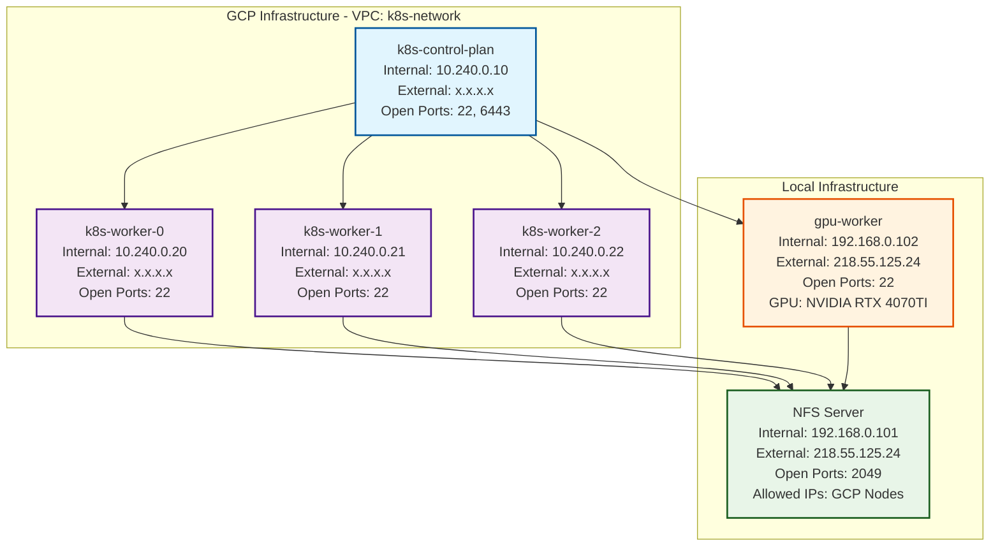

# AI-K8s Practice Repository

GCP 환경에서 kubeadm을 사용한 Kubernetes 클러스터 구축 및 학습 프로젝트

## 기술 스택

### Kubernetes 환경

- **운영체제**: Ubuntu 22.04 LTS
- **Kubernetes**: v1.34.1
- **Container Runtime**: containerd v2.1.4
- **클러스터 부트스트랩**: kubeadm v1.34.1
- **CLI 도구**: kubectl v1.34.1
- **CNI 플러그인**: Calico v3.30.3

### 개발 도구

- **Python 의존성 관리**: uv
- **버전 관리**: Git
- **명령어 관리**: Just
- **인프라 자동화**: Terraform v1.13.2
- **구성 관리**: Ansible v2.19.2

## 아키텍처



## 프로젝트 구조

```
ai-k8s/
├── docs/                           # 학습 문서
├── infra/                          # Infrastructure as Code
│   ├── terraform/                  # GCP 인프라 자동화
│   └── ansible/                    # Kubernetes 구성 자동화
└── README.md                       # 프로젝트 개요 (현재 파일)
```

## 학습 목차

### 1주차: 컨테이너와 Kubernetes 기초

- [컨테이너 이해 - Docker](./docs/week1/01-docker.md)
- [Kubernetes 아키텍처 파악](./docs/week1/02-kubernetes.md)
- [실습환경 기술 명세](./docs/week1/03-lab-setup.md)

## 이슈

- [cgroup 설정 문제](./docs/issue/cgroup.md)
