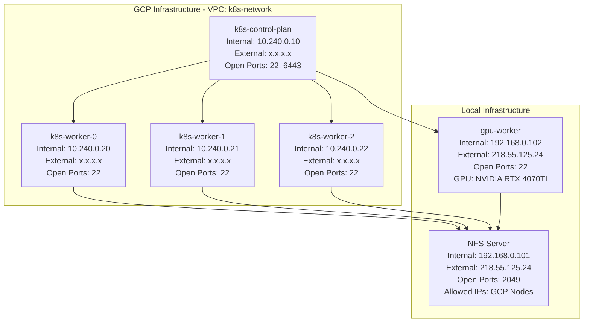

# AI-K8s Practice Repository

GCP 환경에서 kubeadm을 사용한 Kubernetes 클러스터 구축 및 학습 프로젝트

## 기술 스택

### Kubernetes 환경

- **운영체제**: Ubuntu 22.04 LTS
- **Kubernetes**: v1.34.1
- **Container Runtime**: containerd v2.1.4
- **클러스터 부트스트랩**: kubeadm v1.34.1
- **CLI 도구**: kubectl v1.34.1
- **CNI 플러그인**: Calico v3.30.3

### 개발 도구

- **Python 의존성 관리**: uv
- **버전 관리**: Git
- **명령어 관리**: Just
- **인프라 자동화**: Terraform v1.13.2
- **구성 관리**: Ansible v2.19.2

## 아키텍처



## 프로젝트 구조

```
ai-k8s/
├── docs/                           # 학습 문서
├── infra/                          # Infrastructure as Code
│   ├── terraform/                  # GCP 인프라 자동화
│   └── ansible/                    # Kubernetes 구성 자동화
└── README.md                       # 프로젝트 개요 (현재 파일)
```

## 학습 목차

### 이론
- [Docker - 아키텍처 파악](./docs/이론/Docker%20-%20아키텍처%20파악.md)
- [Kubernetes - 아키텍처 파악](./docs/이론/Kubernetes%20-%20아키텍처%20파악.md)
- [Kubernetes - Deployment](./docs/이론/Kubernetes%20-%20Deployment.md)
- [Kubernetes - Service와 Ingress](./docs/이론/Kubernetes%20-%20Service와%20Ingress.md)
- [Kubernetes - ConfigMap과 Secret](./docs/이론/Kubernetes%20-%20ConfigMap과%20Secret.md)
- [Kubernetes - Storage](./docs/이론/Kubernetes%20-%20Storage.md)

### 실습
- [Kubernetes - 실습 환경 구성](./docs/실습/Kubernetes%20-%20실습%20환경%20구성.md)
- [Docker - 아키텍처 파악 실습](./docs/실습/Docker%20-%20아키텍처%20파악%20실습.md)
- [Kubernetes - 아키텍처 파악 실습](./docs/실습/Kubernetes%20-%20아키텍처%20파악%20실습.md)
- [Kubernetes - Deployment 실습](./docs/실습/Kubernetes%20-%20Deployment%20실습.md)
- [Kubernetes - Service와 Ingress 실습](./docs/실습/Kubernetes%20-%20Service와%20Ingress%20실습.md)
- [Kubernetes - ConfigMap과 Secret 실습](./docs/실습/Kubernetes%20-%20ConfigMap과%20Secret%20실습.md)
- [Kubernetes - Storage 실습](./docs/실습/Kubernetes%20-%20Storage%20실습.md)

## 이슈 해결

- [Kubernetes CGroup Driver 불일치](./docs/이슈/Kubernetes%20CGroup%20Driver%20불일치.md)
- [Kubernetes NFS 마운트 실패](./docs/이슈/Kubernetes%20NFS%20마운트%20실패.md)
- [NFSv4 Export 설정 문제](./docs/이슈/NFSv4%20Export%20설정%20문제.md)
