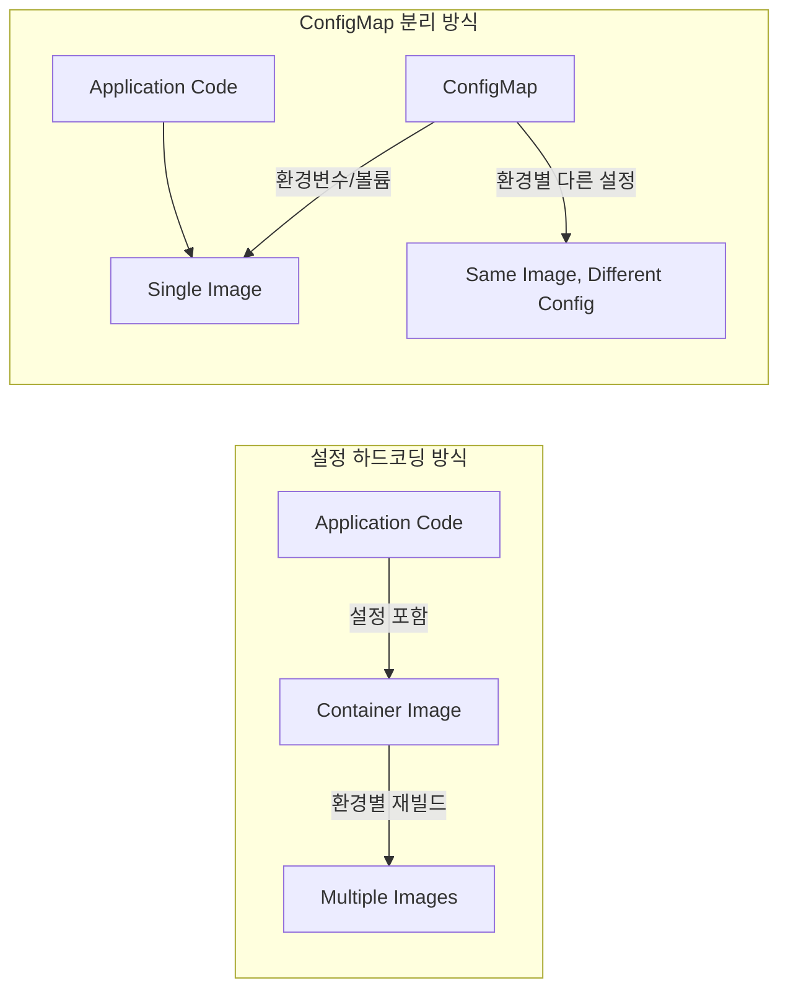
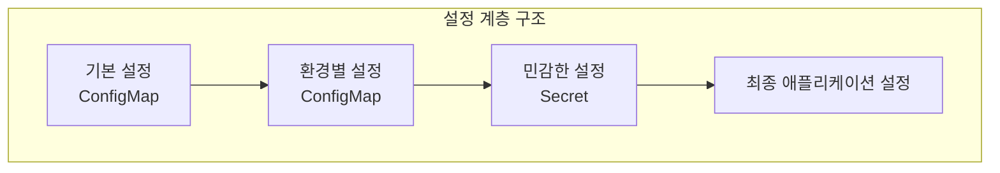

## 개요  
  
Kubernetes에서 **ConfigMap**과 **Secret**은 애플리케이션의 설정과 민감한 데이터를 컨테이너 이미지와 분리하여 관리하는 핵심 리소스입니다. 이를 통해 12-factor app 원칙을 준수하고, 설정 변경 시 이미지 재빌드 없이 애플리케이션을 유연하게 운영할 수 있습니다.  
  
### 핵심 개념  
  
- **ConfigMap**: 비민감한 설정 데이터를 키-값 쌍으로 저장  
- **Secret**: 암호, 토큰, 키 등 민감한 데이터를 안전하게 저장  
- **설정 분리**: 애플리케이션 코드와 설정의 완전한 분리  
- **환경별 관리**: 개발/스테이징/프로덕션 환경별 설정 관리  
  
---  
  
## ConfigMap 이해하기  
  
### ConfigMap이 필요한 이유  
  

  
**문제점 해결**:  
- 설정 변경 시 이미지 재빌드 불필요  
- 환경별 동일한 이미지 사용 가능  
- 설정과 코드의 완전한 분리  
- 민감하지 않은 설정의 투명한 관리  
  
### ConfigMap 구성 요소  
  
#### 1. 데이터 저장 형식  
  
**Key-Value 쌍**:  
- **단순 값**: `database_host: "mysql.example.com"`  
- **JSON 형태**: `{"host": "mysql.example.com", "port": 3306}`  
- **YAML 형태**: 구조화된 설정 데이터  
- **파일 내용**: 전체 설정 파일을 값으로 저장  
  
#### 2. 데이터 크기 제한  
  
**제한사항**:  
- **최대 크기**: ConfigMap당 1MB 제한  
- **etcd 저장**: 모든 데이터가 etcd에 저장되어 클러스터 메모리 영향  
- **대용량 데이터**: PersistentVolume 사용 권장  
  
### ConfigMap 사용 패턴  
  
#### 1. 환경 변수로 주입  
  
**개념**: ConfigMap의 개별 키-값을 컨테이너의 환경 변수로 매핑하는 방식입니다.  
  
**사용 시나리오**:  
- **애플리케이션 설정**: 데이터베이스 URL, API 엔드포인트  
- **기능 플래그**: 특정 기능의 활성화/비활성화  
- **성능 튜닝**: 풀 크기, 타임아웃 값 등  
  
**환경 변수 매핑 방식**:  
- **개별 키 매핑**: 특정 키만 환경 변수로 설정  
- **전체 매핑**: ConfigMap 전체를 환경 변수로 변환  
- **접두사 추가**: 환경 변수 이름에 접두사 추가로 네임스페이스 구분  
  
#### 2. 볼륨으로 마운트  
  
**개념**: ConfigMap을 파일 시스템으로 마운트하여 설정 파일 형태로 사용하는 방식입니다.  
  
**사용 시나리오**:  
- **설정 파일**: nginx.conf, application.yml 등  
- **스크립트 파일**: 초기화 스크립트, 헬스체크 스크립트  
- **인증서**: 공개 키, CA 인증서 등 비민감한 인증 파일  
  
**마운트 특징**:  
- **실시간 업데이트**: ConfigMap 변경 시 마운트된 파일 자동 업데이트  
- **심볼릭 링크**: Kubernetes가 원자적 업데이트를 위해 심볼릭 링크 사용  
- **부분 마운트**: 특정 키만 선택적으로 마운트 가능  
  
#### 3. 명령행 인수  
  
**개념**: ConfigMap 값을 컨테이너 시작 시 명령행 인수로 전달하는 방식입니다.  
  
**사용 시나리오**:  
- **CLI 도구**: 커맨드라인 파라미터가 필요한 애플리케이션  
- **초기화 작업**: 일회성 설정 작업에 필요한 파라미터  
- **레거시 애플리케이션**: 환경 변수를 지원하지 않는 기존 애플리케이션  
  
---  
  
## Secret 이해하기  
  
### Secret이 필요한 이유  
  
**보안 요구사항**:  
- **암호화 저장**: etcd에 base64 인코딩되어 저장 (암호화 at-rest 설정 시 암호화)  
- **접근 제어**: RBAC을 통한 세밀한 접근 권한 관리  
- **메모리 저장**: Secret 데이터는 메모리에만 저장, 디스크 쓰기 방지  
- **감사 로깅**: Secret 접근에 대한 감사 추적  
  
### Secret 타입  
  
#### 1. Opaque (일반 Secret)  
  
**개념**: 사용자가 정의하는 임의의 데이터를 저장하는 기본 Secret 타입입니다.  
  
**사용 시나리오**:  
- **API 키**: 외부 서비스 인증에 필요한 키  
- **데이터베이스 인증**: 사용자명, 비밀번호  
- **암호화 키**: 애플리케이션 레벨 암호화에 사용하는 키  
- **OAuth 토큰**: 인증 토큰 및 리프레시 토큰  
  
**데이터 형식**:  
- 모든 값은 base64로 인코딩되어 저장  
- 텍스트 및 바이너리 데이터 모두 지원  
- 키 이름은 DNS 서브도메인 규칙 준수  
  
#### 2. kubernetes.io/tls  
  
**개념**: TLS 인증서와 개인 키를 저장하는 특화된 Secret 타입입니다.  
  
**필수 키**:  
- **tls.crt**: TLS 인증서 (PEM 형식)  
- **tls.key**: TLS 개인 키 (PEM 형식)  
  
**사용 시나리오**:  
- **Ingress TLS**: HTTPS 종료를 위한 인증서  
- **서비스 간 mTLS**: 마이크로서비스 간 상호 인증  
- **웹훅 인증**: Kubernetes API와 외부 시스템 간 보안 통신  
  
**인증서 관리**:  
- **cert-manager 연동**: 자동 인증서 발급 및 갱신  
- **인증서 체인**: 중간 인증서 포함 가능  
- **와일드카드 인증서**: 여러 서브도메인 지원  
  
#### 3. kubernetes.io/dockerconfigjson  
  
**개념**: Docker 레지스트리 인증 정보를 저장하는 Secret 타입입니다.  
  
**구성 요소**:  
- **auths**: 레지스트리별 인증 정보  
- **username/password**: 기본 인증 방식  
- **auth token**: Base64 인코딩된 인증 문자열  
  
**사용 시나리오**:  
- **Private Registry**: 사설 Docker 레지스트리 접근  
- **멀티 레지스트리**: 여러 레지스트리에 대한 인증 정보 통합  
- **CI/CD 파이프라인**: 자동화된 이미지 배포  
  
#### 4. kubernetes.io/service-account-token  
  
**개념**: ServiceAccount의 API 서버 접근 토큰을 저장하는 Secret 타입입니다.  
  
**자동 생성**:  
- ServiceAccount 생성 시 자동으로 연결  
- Pod에 자동으로 마운트되어 API 서버 인증에 사용  
- 토큰 만료 및 자동 갱신 지원  
  
**토큰 특징**:  
- **JWT 형식**: JSON Web Token 표준 준수  
- **만료 시간**: 설정 가능한 토큰 만료 시간  
- **권한 제한**: RBAC으로 세밀한 권한 제어  
  
### Secret 보안 모델  
  
#### 1. 암호화  
  
**At-Rest 암호화**:  
- **etcd 암호화**: etcd 저장소 레벨에서 데이터 암호화  
- **KMS 통합**: 외부 Key Management Service와 연동  
- **Envelope 암호화**: 데이터 암호화 키를 별도 암호화  
  
**In-Transit 암호화**:  
- **TLS 통신**: API 서버와 kubelet 간 암호화 통신  
- **mTLS**: 상호 TLS 인증으로 보안 강화  
  
#### 2. 접근 제어  
  
**RBAC 통합**:  
- **Namespace 격리**: Secret은 네임스페이스 범위 리소스  
- **세밀한 권한**: create, get, list, update, delete 권한 분리  
- **ServiceAccount 연결**: Pod 실행 시 필요한 최소 권한만 부여  
  
**Pod 보안 정책**:  
- **읽기 전용 마운트**: Secret 수정 방지  
- **특정 경로 마운트**: 보안이 필요한 특정 경로에만 마운트  
- **환경 변수 제한**: Secret 환경 변수 노출 최소화  
  
#### 3. 감사 및 모니터링  
  
**감사 로깅**:  
- **Secret 접근 추적**: 모든 Secret 접근 기록  
- **변경 이력**: Secret 생성, 수정, 삭제 이력 관리  
- **API 호출 감사**: kubectl 및 프로그래밍 방식 접근 추적  
  
**모니터링 지표**:  
- **Secret 사용량**: 네임스페이스별 Secret 개수 추적  
- **만료 예정**: 인증서 및 토큰 만료 예정 알림  
- **비정상 접근**: 권한 없는 Secret 접근 시도 감지  
  
---  
  
## ConfigMap과 Secret 비교  
  
| 특징 | ConfigMap | Secret |  
|------|-----------|--------|  
| **데이터 타입** | 비민감한 설정 데이터 | 민감한 인증 정보 |  
| **저장 방식** | 평문으로 etcd 저장 | base64 인코딩 + 암호화 옵션 |  
| **메모리 처리** | 일반 저장 | 메모리에만 저장 |  
| **접근 제어** | 기본 RBAC | 강화된 RBAC + 감사 |  
| **크기 제한** | 1MB | 1MB |  
| **사용 방식** | 환경변수, 볼륨, 명령행 | 환경변수, 볼륨 |  
| **업데이트** | 실시간 반영 | 실시간 반영 |  
| **디버깅** | kubectl로 쉽게 확인 | base64 디코딩 필요 |  
  
---  
  
## 설정 관리 패턴  
  
### 1. 계층별 설정 관리  
  
**개념**: 애플리케이션 설정을 중요도와 보안 수준에 따라 계층적으로 관리하는 패턴입니다.  
  

  
**계층 구분**:  
- **기본 설정**: 모든 환경에서 공통으로 사용하는 설정  
- **환경별 설정**: 개발/스테이징/프로덕션별 차별화된 설정  
- **민감한 설정**: 보안이 필요한 인증 정보 및 키  
- **런타임 설정**: 애플리케이션 실행 중 동적으로 변경되는 설정  
  
### 2. 환경별 설정 전략  
  
#### 환경 분리 전략  
  
**네임스페이스 기반 분리**:  
- **개발 환경**: `development` 네임스페이스  
- **스테이징 환경**: `staging` 네임스페이스  
- **프로덕션 환경**: `production` 네임스페이스  
  
**이름 규칙 기반 분리**:  
- **접미사 방식**: `app-config-dev`, `app-config-prod`  
- **라벨 기반**: `environment: production` 라벨로 구분  
- **디렉토리 구조**: GitOps에서 환경별 디렉토리 분리  
  
#### 설정 상속 패턴  
  
**계층적 오버라이드**:  
1. **기본 설정**: 모든 환경 공통 기본값  
2. **환경 설정**: 환경별 특화 설정으로 기본값 오버라이드  
3. **인스턴스 설정**: 특정 인스턴스별 설정으로 최종 오버라이드  
  
### 3. 버전 관리 전략  
  
#### GitOps 통합  
  
**설정 버전 관리**:  
- **Git Repository**: 모든 ConfigMap과 Secret 매니페스트를 Git으로 관리  
- **브랜치 전략**: 환경별 브랜치 또는 디렉토리 구조  
- **Pull Request**: 설정 변경에 대한 코드 리뷰 프로세스  
- **자동 배포**: ArgoCD, Flux 등으로 자동 동기화  
  
**변경 추적**:  
- **Commit History**: 설정 변경 이력 및 이유 추적  
- **태그 기반**: 릴리스별 설정 스냅샷 관리  
- **롤백 지원**: 이전 설정으로 빠른 롤백 가능  
  
#### 설정 검증  
  
**스키마 검증**:  
- **JSON Schema**: ConfigMap 데이터 구조 검증  
- **YAML Lint**: 문법 오류 사전 검증  
- **사용자 정의 검증**: 비즈니스 규칙 검증 로직  
  
**테스트 자동화**:  
- **Dry Run**: 변경 사항 적용 전 검증  
- **스모크 테스트**: 설정 변경 후 기본 기능 검증  
- **통합 테스트**: 전체 시스템 레벨 설정 검증  
  
---  
  
## 보안 모범 사례  
  
### 1. Secret 라이프사이클 관리  
  
#### 생성 및 배포  
  
**보안 생성 프로세스**:  
- **외부 시크릿 관리자**: HashiCorp Vault, AWS Secrets Manager 연동  
- **자동 생성**: cert-manager를 통한 인증서 자동 생성  
- **최소 권한 원칙**: Secret 생성에 필요한 최소 권한만 부여  
  
**안전한 배포**:  
- **Sealed Secrets**: 암호화된 형태로 Git 저장소 관리  
- **External Secrets Operator**: 외부 시크릿 저장소와 동기화  
- **SOPS**: 파일 레벨 암호화로 민감한 데이터 보호  
  
#### 순환 및 갱신  
  
**자동 순환 정책**:  
- **주기적 갱신**: 정해진 주기마다 자동으로 Secret 갱신  
- **이벤트 기반 갱신**: 보안 사고 또는 퇴사자 발생 시 즉시 갱신  
- **점진적 배포**: 새로운 Secret으로 점진적 전환  
  
**갱신 프로세스**:  
- **무중단 갱신**: 서비스 중단 없이 Secret 교체  
- **롤백 지원**: 문제 발생 시 이전 Secret으로 빠른 복구  
- **검증 프로세스**: 새로운 Secret 유효성 확인  
  
### 2. 접근 제어 강화  
  
#### RBAC 세분화  
  
**역할 기반 접근**:  
- **개발자**: ConfigMap 읽기/쓰기, Secret 읽기만  
- **운영자**: 모든 ConfigMap/Secret 관리 권한  
- **애플리케이션**: 필요한 특정 Secret만 접근  
  
**네임스페이스 격리**:  
- **완전 격리**: 네임스페이스 간 Secret 공유 금지  
- **제한된 공유**: 특정 시스템 Secret만 선택적 공유  
- **계층적 권한**: 상위 네임스페이스에서 하위로 권한 상속  
  
#### Pod Security Standards  
  
**보안 컨텍스트 설정**:  
- **비루트 사용자**: Secret 접근 시 비루트 사용자로 실행  
- **읽기 전용 파일시스템**: Secret 마운트 경로 읽기 전용 설정  
- **권한 최소화**: 불필요한 Linux Capabilities 제거  
  
### 3. 모니터링 및 감사  
  
#### Secret 사용 추적  
  
**접근 로깅**:  
- **API 감사**: Kubernetes API를 통한 모든 Secret 접근 기록  
- **Pod 레벨 감사**: 특정 Pod에서 Secret 사용 패턴 분석  
- **비정상 패턴 감지**: 평소와 다른 Secret 접근 패턴 알림  
  
**메트릭 수집**:  
- **사용량 통계**: Secret 사용 빈도 및 패턴 분석  
- **만료 추적**: 인증서 및 토큰 만료 예정 모니터링  
- **성능 영향**: Secret 로딩이 애플리케이션 성능에 미치는 영향 측정  
  
---  
  
## 실무 적용 패턴  
  
### 1. 마이크로서비스 설정 관리  
  
**서비스별 설정 분리**:  
- **독립적 ConfigMap**: 각 마이크로서비스별 전용 ConfigMap  
- **공통 설정**: 여러 서비스가 공유하는 설정은 별도 ConfigMap  
- **의존성 관리**: 서비스 간 설정 의존성 최소화  
  
**설정 전파 패턴**:  
- **Event-driven**: 설정 변경 시 관련 서비스에 이벤트 전송  
- **Pull-based**: 서비스가 주기적으로 설정 변경 확인  
- **Push-based**: 중앙 설정 관리자가 서비스에 변경 푸시  
  
### 2. 데이터베이스 연결 관리  
  
**연결 정보 분리**:  
- **ConfigMap**: 호스트명, 포트, 데이터베이스명  
- **Secret**: 사용자명, 비밀번호, 연결 문자열  
- **환경별 분리**: 개발/스테이징/프로덕션 데이터베이스 분리  
  
**연결 풀 설정**:  
- **성능 튜닝**: 환경별 최적화된 연결 풀 설정  
- **장애 복구**: 타임아웃, 재시도 정책 설정  
- **모니터링**: 연결 상태 및 성능 메트릭 수집  
  
### 3. 외부 서비스 통합  
  
**API 키 관리**:  
- **서비스별 분리**: 외부 서비스별 전용 Secret  
- **권한 최소화**: 필요한 최소 권한만 가진 API 키 사용  
- **정기 순환**: API 키 정기적 갱신 및 교체  
  
**인증서 관리**:  
- **자동 갱신**: cert-manager를 통한 인증서 자동 관리  
- **멀티 도메인**: SAN 인증서로 여러 도메인 지원  
- **인증서 체인**: 완전한 인증서 체인 구성  
  
---  
  
## 문제 해결 및 디버깅  
  
### 1. 일반적인 문제  
  
#### ConfigMap 문제  
  
**설정 적용 안됨**:  
- **원인**: Pod 재시작 없이 환경 변수 변경 불가  
- **해결**: 볼륨 마운트 방식 사용 또는 Pod 재시작  
- **예방**: 애플리케이션에서 설정 파일 동적 리로딩 구현  
  
**특수 문자 문제**:  
- **원인**: YAML 파싱 오류로 인한 설정 깨짐  
- **해결**: 특수 문자가 포함된 값을 따옴표로 감싸기  
- **예방**: 설정 검증 스크립트 사용  
  
#### Secret 문제  
  
**Base64 인코딩 오류**:  
- **원인**: 잘못된 base64 인코딩으로 Secret 데이터 손상  
- **해결**: 올바른 base64 인코딩 도구 사용  
- **예방**: Secret 생성 시 자동화된 스크립트 사용  
  
**권한 거부**:  
- **원인**: RBAC 설정 오류로 Secret 접근 불가  
- **해결**: ServiceAccount와 RoleBinding 확인  
- **예방**: 최소 권한 원칙 기반 RBAC 설계  
  
### 2. 디버깅 방법론  
  
#### 단계별 진단  
  
**1단계: 리소스 확인**:  
- ConfigMap/Secret 존재 여부 확인  
- 네임스페이스 및 라벨 일치성 검증  
- 데이터 내용 및 형식 검증  
  
**2단계: Pod 설정 확인**:  
- 환경 변수 또는 볼륨 마운트 설정 검증  
- Pod 스펙에서 ConfigMap/Secret 참조 확인  
- 컨테이너 내부에서 실제 데이터 확인  
  
**3단계: 권한 확인**:  
- ServiceAccount 권한 검증  
- RBAC 정책 확인  
- 네임스페이스 간 접근 권한 검증  
  
---  
  
## 참고 문서  
  
### Kubernetes 공식 문서  
  
- [ConfigMaps](https://kubernetes.io/docs/concepts/configuration/configmap/)  
- [Secrets](https://kubernetes.io/docs/concepts/configuration/secret/)  
- [Managing Secret using kubectl](https://kubernetes.io/docs/tasks/configmap-secret/managing-secret-using-kubectl/)  
- [Managing ConfigMap using kubectl](https://kubernetes.io/docs/tasks/configmap-secret/managing-secret-using-config-file/)  
  
### 보안 관련 문서  
  
- [Pod Security Standards](https://kubernetes.io/docs/concepts/security/pod-security-standards/)  
- [Secrets Good Practices](https://kubernetes.io/docs/concepts/security/secrets-good-practices/)  
- [Encrypting Secret Data at Rest](https://kubernetes.io/docs/tasks/administer-cluster/encrypt-data/)  
  
### 도구 및 확장  
  
- [External Secrets Operator](https://external-secrets.io/)  
- [Sealed Secrets](https://sealed-secrets.netlify.app/)  
- [cert-manager](https://cert-manager.io/)  
  
---  
  
## 다음 학습  
  
ConfigMap과 Secret의 기본 개념을 이해했으니, 다음에는 Storage Class와 PVC를 학습하여 영구 데이터 저장소 관리에 대해 알아보겠습니다.