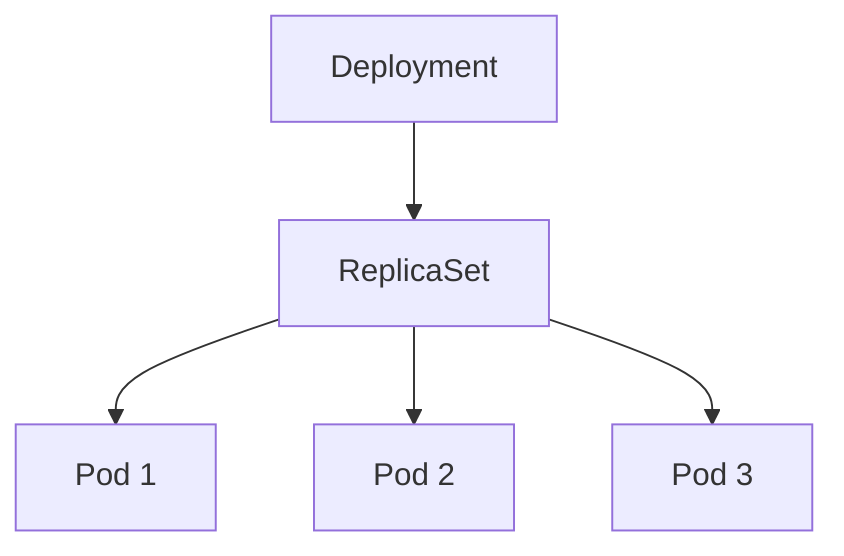
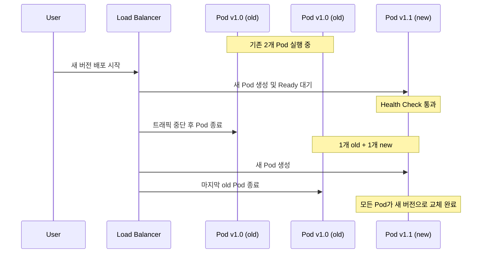

  
## 개요  
  
Deployment는 Kubernetes에서 **애플리케이션의 선언적 배포와 관리**를 담당하는 핵심 리소스입니다. Pod의 생성, 업데이트, 스케일링, 롤백을 자동화하여 **안정적이고 예측 가능한 애플리케이션 배포  
**를 제공합니다.  
  
### Deployment의 핵심 기능  
  
- **선언적 업데이트**: 원하는 상태를 정의하면 자동으로 현재 상태를 맞춤  
- **롤링 업데이트**: 무중단 배포를 통한 서비스 가용성 보장  
- **롤백**: 문제 발생 시 이전 버전으로 빠른 복구  
- **스케일링**: 애플리케이션 인스턴스 수 동적 조정  
- **셀프 힐링**: 실패한 Pod 자동 재시작  
  
---  
  
## Pod vs ReplicaSet vs Deployment  
  
### 계층적 관계  
  

  
### 각 리소스의 역할과 특징  
  
| 리소스            | 목적        | 주요 기능             | 사용 시나리오            |  
|----------------|-----------|-------------------|--------------------|  
| **Pod**        | 최소 실행 단위  | 컨테이너 그룹 실행        | 단일 컨테이너 테스트, 디버깅   |  
| **ReplicaSet** | Pod 복제 관리 | 지정된 수의 Pod 유지     | 직접 사용은 권장하지 않음     |  
| **Deployment** | 선언적 배포 관리 | 롤링 업데이트, 롤백, 히스토리 | **일반적인 애플리케이션 배포** |  
  
### 왜 Deployment를 사용해야 하는가?  
  
#### Pod 직접 사용의 문제점  
  
```yaml  
# 직접 Pod 생성 (권장하지 않음)  
apiVersion: v1  
kind: Pod  
metadata:  
  name: nginx-pod  
spec:  
  containers:  
    - name: nginx  
      image: nginx:1.21  
```  
  
**문제점**: Pod 삭제 시 복구 불가, 업데이트 시 수동 재생성 필요  
  
#### ReplicaSet 직접 사용의 한계  
  
```yaml  
# ReplicaSet 직접 사용 (권장하지 않음)  
apiVersion: apps/v1  
kind: ReplicaSet  
metadata:  
  name: nginx-rs  
spec:  
  replicas: 3  
  selector:  
    matchLabels:  
      app: nginx  
  template:  
    metadata:  
      labels:  
        app: nginx  
    spec:  
      containers:  
        - name: nginx  
          image: nginx:1.21  
```  
  
**한계점**: 롤링 업데이트 불가, 히스토리 관리 없음, 롤백 불가  
  
#### Deployment 사용의 장점  
  
```yaml  
# Deployment 사용 (권장)  
apiVersion: apps/v1  
kind: Deployment  
metadata:  
  name: nginx-deployment  
spec:  
  replicas: 3  
  selector:  
    matchLabels:  
      app: nginx  
  template:  
    metadata:  
      labels:  
        app: nginx  
    spec:  
      containers:  
        - name: nginx  
          image: nginx:1.21  
```  
  
**장점**: 자동 롤링 업데이트, 롤백 지원, 히스토리 관리, 선언적 관리  
  
---  
  
## Deployment 리소스 상세  
  
### 기본 구조  
  
```yaml  
apiVersion: apps/v1  
kind: Deployment  
metadata:  
  name: my-app-deployment  
  namespace: default  
  labels:  
    app: my-app  
    version: v1  
spec:  
  # 복제본 수  
  replicas: 3  
  
  # Pod 셀렉터 (ReplicaSet이 관리할 Pod 식별)  
  selector:  
    matchLabels:  
      app: my-app  
  
  # 업데이트 전략  
  strategy:  
    type: RollingUpdate  
    rollingUpdate:  
      maxUnavailable: 1  
      maxSurge: 1  
  
  # Pod 템플릿  
  template:  
    metadata:  
      labels:  
        app: my-app  
        version: v1  
    spec:  
      containers:  
        - name: app-container  
          image: nginx:1.21  
          ports:  
            - containerPort: 80  
          resources:  
            requests:  
              memory: "64Mi"  
              cpu: "250m"  
            limits:  
              memory: "128Mi"  
              cpu: "500m"  
```  
  
### 주요 필드 설명  
  
#### `spec.replicas`  
  
- 원하는 Pod 복제본 수  
- 동적 스케일링 가능: `kubectl scale deployment my-app --replicas=5`  
  
#### `spec.selector`  
  
- ReplicaSet이 관리할 Pod를 식별하는 라벨 셀렉터  
- `template.metadata.labels`와 일치해야 함  
- **불변 필드**: 생성 후 변경 불가  
  
#### `spec.template`  
  
- Pod 생성 시 사용할 템플릿  
- Pod 명세와 동일한 구조  
- 변경 시 자동으로 롤링 업데이트 트리거  
  
---  
  
## Rolling Update 전략  
  
### 무중단 배포 원리  
  
Rolling Update는 **기존 Pod를 점진적으로 새 버전으로 교체**하여 서비스 중단 없이 애플리케이션을 업데이트하는 방식입니다.  
  

  
### 배포 전략 타입  
  
#### 1. RollingUpdate (기본값, 권장)  
  
```yaml  
spec:  
  strategy:  
    type: RollingUpdate  
    rollingUpdate:  
      maxUnavailable: 25%    # 동시에 사용 불가능한 Pod 최대 비율  
      maxSurge: 25%          # 추가로 생성 가능한 Pod 최대 비율  
```  
  
**동작 방식**:  
  
- 새 Pod 생성 → Ready 상태 확인 → 기존 Pod 종료  
- `maxUnavailable`과 `maxSurge`로 배포 속도 조절  
  
**장점**: 무중단 서비스, 점진적 배포로 리스크 최소화  
**단점**: 배포 시간이 상대적으로 오래 걸림  
  
#### 2. Recreate  
  
```yaml  
spec:  
  strategy:  
    type: Recreate  
```  
  
**동작 방식**:  
  
- 모든 기존 Pod 종료 → 새 Pod 생성  
  
**장점**: 빠른 배포, 리소스 절약  
**단점**: 서비스 중단 발생  
  
### maxUnavailable과 maxSurge 예제  
  
```yaml  
# 예제: replicas=4인 경우  
spec:  
  replicas: 4  
  strategy:  
    type: RollingUpdate  
    rollingUpdate:  
      maxUnavailable: 1      # 최소 3개 Pod 유지  
      maxSurge: 2            # 최대 6개 Pod까지 생성 가능  
```  
  
**배포 과정**:  
  
1. 초기: 4개 Pod (v1) 실행  
2. 2개 새 Pod (v2) 생성 → 총 6개 Pod  
3. 1개 기존 Pod (v1) 종료 → 5개 Pod (3개 v1 + 2개 v2)  
4. 과정 반복하여 모든 Pod를 v2로 교체  
  
---  
  
## Rollback 메커니즘  
  
### 배포 히스토리 관리  
  
Kubernetes는 Deployment의 **revision history**를 자동으로 관리합니다.  
  
```bash  
# 배포 히스토리 확인  
kubectl rollout history deployment/nginx-deployment  
  
# 출력 예시  
REVISION  CHANGE-CAUSE  
1         <none>  
2         kubectl set image deployment/nginx-deployment nginx=nginx:1.22  
3         kubectl set image deployment/nginx-deployment nginx=nginx:1.23  
```  
  
### 히스토리 보존 설정  
  
```yaml  
spec:  
  # 보존할 리비전 수 (기본값: 10)  
  revisionHistoryLimit: 3  
```  
  
### 롤백 시나리오  
  
#### 1. 최신 배포 롤백  
  
```bash  
# 이전 버전으로 즉시 롤백  
kubectl rollout undo deployment/nginx-deployment  
```  
  
#### 2. 특정 리비전으로 롤백  
  
```bash  
# 리비전 1로 롤백  
kubectl rollout undo deployment/nginx-deployment --to-revision=1  
```  
  
#### 3. 배포 상태 모니터링  
  
```bash  
# 배포 진행 상태 확인  
kubectl rollout status deployment/nginx-deployment  
  
# 실시간 Pod 상태 확인  
kubectl get pods -l app=nginx -w  
```  
  
### 자동 롤백 시나리오  
  
```yaml  
spec:  
  # 배포 실패 시 자동 롤백 설정  
  progressDeadlineSeconds: 600  # 10분 내 배포 완료되지 않으면 실패로 간주  
```  
  
**자동 롤백 트리거 조건**:  
  
- Health Check 실패  
- 이미지 Pull 실패  
- 지정된 시간 내 Ready 상태 도달 실패  
  
---  
  
## Health Check (Probe)  
  
### Probe 타입 비교  
  
| Probe 타입            | 목적           | 실패 시 동작 | 사용 시점             |  
|---------------------|--------------|---------|-------------------|  
| **Liveness Probe**  | 컨테이너 생존 확인   | Pod 재시작 | 애플리케이션 교착상태 감지    |  
| **Readiness Probe** | 트래픽 수신 준비 확인 | 트래픽 차단  | 초기화 완료, 의존성 준비 확인 |  
| **Startup Probe**   | 초기 시작 확인     | Pod 재시작 | 느린 시작 애플리케이션      |  
  
### 1. Liveness Probe  
  
컨테이너가 정상적으로 실행 중인지 확인합니다.  
  
```yaml  
spec:  
  containers:  
    - name: app  
      image: my-app:latest  
      livenessProbe:  
        httpGet:  
          path: /health  
          port: 8080  
          httpHeaders:  
            - name: Custom-Header  
              value: health-check  
        initialDelaySeconds: 30    # 첫 번째 체크까지 대기 시간  
        periodSeconds: 10          # 체크 주기  
        timeoutSeconds: 5          # 응답 대기 시간  
        failureThreshold: 3        # 연속 실패 횟수  
        successThreshold: 1        # 성공으로 간주할 연속 성공 횟수  
```  
  
### 2. Readiness Probe  
  
Pod가 트래픽을 받을 준비가 되었는지 확인합니다.  
  
```yaml  
spec:  
  containers:  
    - name: app  
      image: my-app:latest  
      readinessProbe:  
        httpGet:  
          path: /ready  
          port: 8080  
        initialDelaySeconds: 5  
        periodSeconds: 5  
        timeoutSeconds: 3  
        failureThreshold: 3  
```  
  
### 3. Startup Probe  
  
애플리케이션 초기 시작을 확인합니다 (느린 시작 앱용).  
  
```yaml  
spec:  
  containers:  
    - name: slow-app  
      image: slow-startup-app:latest  
      startupProbe:  
        httpGet:  
          path: /startup  
          port: 8080  
        initialDelaySeconds: 10  
        periodSeconds: 10  
        timeoutSeconds: 5  
        failureThreshold: 30       # 최대 5분 (30 * 10초) 대기  
```  
  
### Probe 구성 방법  
  
#### HTTP GET  
  
```yaml  
livenessProbe:  
  httpGet:  
    path: /healthz  
    port: 8080  
    scheme: HTTP              # HTTP 또는 HTTPS  
```  
  
#### TCP Socket  
  
```yaml  
livenessProbe:  
  tcpSocket:  
    port: 3306  
```  
  
#### Command Execution  
  
```yaml  
livenessProbe:  
  exec:  
    command:  
      - /bin/sh  
      - -c  
      - "pg_isready -U postgres"  
```  
  
### 실무 베스트 프랙티스  
  
#### 1. 적절한 타임아웃 설정  
  
```yaml  
# 예시: 데이터베이스 애플리케이션  
readinessProbe:  
  httpGet:  
    path: /ready  
    port: 8080  
  initialDelaySeconds: 15     # DB 연결 시간 고려  
  periodSeconds: 10  
  timeoutSeconds: 5  
  failureThreshold: 3  
```  
  
#### 2. 의존성 체크 포함  
  
```yaml  
# Readiness에서 외부 의존성 확인  
readinessProbe:  
  httpGet:  
    path: /ready              # DB, Redis 연결 상태 확인  
    port: 8080  
```  
  
#### 3. Liveness는 단순하게  
  
```yaml  
# Liveness는 애플리케이션 자체 상태만 확인  
livenessProbe:  
  httpGet:  
    path: /health            # 단순한 상태 확인만  
    port: 8080  
```  
  
---  
  
## 실무 베스트 프랙티스  
  
### 1. 리소스 제한 설정  
  
```yaml  
spec:  
  template:  
    spec:  
      containers:  
        - name: app  
          image: my-app:latest  
          resources:  
            requests: # 최소 보장 리소스  
              memory: "128Mi"  
              cpu: "100m"  
            limits: # 최대 사용 가능 리소스  
              memory: "256Mi"  
              cpu: "200m"  
```  
  
### 2. 라벨링 전략  
  
```yaml  
metadata:  
  name: my-app-deployment  
  labels:  
    app: my-app  
    tier: frontend  
    version: v1.2.3  
    environment: production  
spec:  
  template:  
    metadata:  
      labels:  
        app: my-app  
        tier: frontend  
        version: v1.2.3  
        environment: production  
```  
  
### 3. 환경별 설정 분리  
  
```yaml  
# production.yaml  
spec:  
  replicas: 5  
  strategy:  
    rollingUpdate:  
      maxUnavailable: 1  
      maxSurge: 2  
  
# staging.yaml  
spec:  
  replicas: 2  
  strategy:  
    rollingUpdate:  
      maxUnavailable: 0  
      maxSurge: 1  
```  
  
### 4. 보안 강화  
  
```yaml  
spec:  
  template:  
    spec:  
      securityContext:  
        runAsNonRoot: true  
        runAsUser: 1000  
        fsGroup: 2000  
      containers:  
        - name: app  
          securityContext:  
            allowPrivilegeEscalation: false  
            readOnlyRootFilesystem: true  
            capabilities:  
              drop:  
                - ALL  
```  
  
### 5. 모니터링 포인트  
  
```bash  
# 주요 모니터링 명령어  
kubectl get deployments                                    # 배포 상태 확인  
kubectl describe deployment my-app                        # 상세 정보  
kubectl rollout status deployment/my-app                  # 배포 진행 상태  
kubectl get replicasets -l app=my-app                    # ReplicaSet 상태  
kubectl get pods -l app=my-app -o wide                   # Pod 배치 상태  
kubectl top pods -l app=my-app                           # 리소스 사용량  
```  
  
---  
  
## 참고 문서  
  
### Kubernetes 공식 문서  
  
- [Deployments](https://kubernetes.io/docs/concepts/workloads/controllers/deployment/)  
- [ReplicaSet](https://kubernetes.io/docs/concepts/workloads/controllers/replicaset/)  
- [Pod Lifecycle](https://kubernetes.io/docs/concepts/workloads/pods/pod-lifecycle/)  
- [Rolling Update](https://kubernetes.io/docs/tutorials/kubernetes-basics/update/update-intro/)  
- [Configure Liveness and Readiness Probes](https://kubernetes.io/docs/tasks/configure-pod-container/configure-liveness-readiness-startup-probes/)