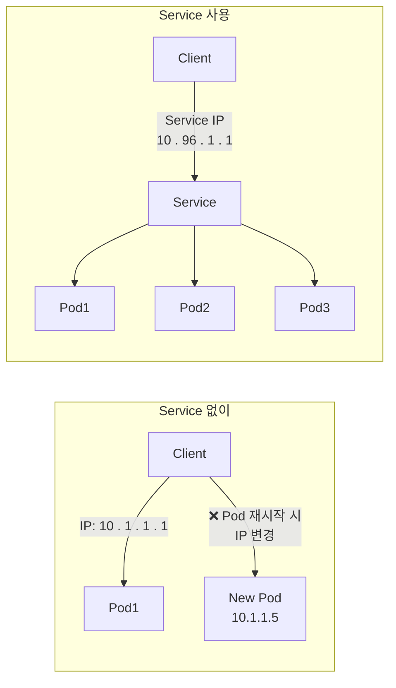
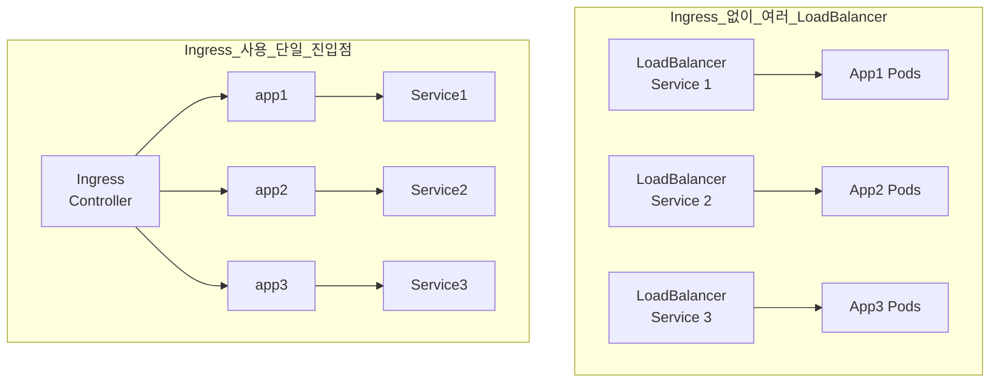

## 개요  
  
Kubernetes에서 **Service**는 Pod 집합에 대한 안정적인 네트워크 엔드포인트를 제공하고, **Ingress**는 클러스터 외부에서 내부 서비스로의 HTTP/HTTPS 라우팅을 관리합니다. 이 두  
리소스는 애플리케이션을 외부에 노출하고 로드 밸런싱을 제공하는 핵심 구성 요소입니다.  
  
### 핵심 개념  
  
- **Service**: Pod의 논리적 집합과 접근 정책을 정의  
- **Ingress**: L7(HTTP/HTTPS) 레벨의 라우팅 규칙 정의  
- **Service Discovery**: DNS를 통한 서비스 검색  
- **Load Balancing**: 트래픽 분산 처리  
  
---  
  
## Service 이해하기  
  
### Service가 필요한 이유  
  

  
**문제점 해결**:  
  
- Pod IP는 동적으로 변경됨  
- 여러 Pod에 대한 로드 밸런싱 필요  
- 서비스 디스커버리 메커니즘 필요  
  
### Service 타입  
  
| 타입               | 접근 범위             | 사용 사례      | IP 할당                                |  
|------------------|-------------------|------------|--------------------------------------|  
| **ClusterIP**    | 클러스터 내부만          | 내부 마이크로서비스 | Cluster IP                           |  
| **NodePort**     | 노드 IP:Port로 외부 접근 | 개발/테스트 환경  | Cluster IP + Node Port               |  
| **LoadBalancer** | 클라우드 LB 통해 외부 접근  | 프로덕션 환경    | Cluster IP + Node Port + External IP |  
| **ExternalName** | 외부 도메인 매핑         | 외부 서비스 연동  | 없음 (CNAME)                           |  
  
---  
  
## Service 타입별 상세  
  
### 1. ClusterIP (기본값)  
  
**개념**: 클러스터 내부에서만 접근 가능한 가상 IP를 할당하는 기본 서비스 타입입니다.  
  
**작동 원리**:  
  
- kube-proxy가 iptables 또는 IPVS 규칙을 생성하여 트래픽 분산  
- Service IP는 가상 IP로 실제 네트워크 인터페이스에 할당되지 않음  
- kube-dns/CoreDNS가 Service 이름을 IP로 해석  
  
**사용 시나리오**:  
  
- 내부 마이크로서비스 간 통신  
- 데이터베이스, 캐시 서버 등 내부 백엔드 서비스  
- 외부 노출이 필요 없는 관리 서비스  
  
**DNS 해석 메커니즘**:  
  
- 짧은 이름: `<service-name>` (같은 네임스페이스)  
- 정규화된 도메인: `<service-name>.<namespace>.svc.cluster.local`  
- SRV 레코드로 포트 정보도 조회 가능  
  
### 2. NodePort  
  
**개념**: 클러스터의 모든 노드에 동일한 포트를 할당하여 외부에서 접근할 수 있게 하는 서비스 타입입니다.  
  
**작동 원리**:  
  
- 모든 노드의 지정된 포트(30000-32767 범위)로 들어오는 트래픽을 Service로 전달  
- ClusterIP 기능을 포함하므로 내부 접근도 가능  
- kube-proxy가 NodePort 트래픽을 적절한 Pod로 라우팅  
  
**포트 매핑 구조**:  
  
- **nodePort**: 외부에서 접근하는 노드 포트  
- **port**: Service의 ClusterIP 포트  
- **targetPort**: Pod 내 컨테이너 포트  
  
**사용 시나리오**:  
  
- 개발 및 테스트 환경에서 간단한 외부 접근  
- 로드 밸런서가 없는 온프레미스 환경  
- 특정 포트로 직접 접근이 필요한 레거시 애플리케이션  
  
**제한사항**:  
  
- 포트 범위 제한 (30000-32767)  
- 방화벽 규칙 관리 필요  
- 고정 IP가 아닌 노드 IP 의존  
  
### 3. LoadBalancer  
  
**개념**: 클라우드 제공자의 네이티브 로드 밸런서를 자동으로 프로비저닝하는 서비스 타입입니다.  
  
**작동 원리**:  
  
- 클라우드 컨트롤러 매니저가 클라우드 제공자 API 호출  
- 외부 로드 밸런서 생성 및 NodePort Service에 연결  
- NodePort와 ClusterIP 기능을 모두 포함  
  
**클라우드별 구현**:  
  
- **GCP**: Google Cloud Load Balancer (L4/L7)  
- **AWS**: Elastic Load Balancer (ALB/NLB)  
- **Azure**: Azure Load Balancer  
  
**로드 밸런싱 레벨**:  
  
- **L4 (Transport Layer)**: IP와 포트 기반 라우팅  
- **L7 (Application Layer)**: HTTP/HTTPS 헤더 기반 라우팅  
  
**사용 시나리오**:  
  
- 프로덕션 환경의 외부 서비스 노출  
- 고가용성이 요구되는 웹 애플리케이션  
- 자동 스케일링과 연동된 서비스  
  
**비용 고려사항**:  
  
- 클라우드 제공자의 로드 밸런서 요금 발생  
- Service 개수만큼 로드 밸런서 생성  
- Ingress를 통한 비용 최적화 고려 필요  
  
### 4. ExternalName  
  
**개념**: 외부 도메인을 Kubernetes Service 이름으로 매핑하여 추상화 계층을 제공하는 특수한 서비스 타입입니다.  
  
**작동 원리**:  
  
- DNS CNAME 레코드를 통한 도메인 별칭 생성  
- kube-dns/CoreDNS가 Service 이름을 외부 도메인으로 해석  
- 프록시나 라우팅 없이 순수 DNS 레벨에서 동작  
  
**사용 시나리오**:  
  
- **외부 서비스 추상화**: 외부 API나 데이터베이스를 Service로 참조  
- **환경별 엔드포인트 관리**: 개발/스테이징/프로덕션 환경별 다른 외부 서비스  
- **레거시 시스템 통합**: 기존 외부 시스템을 Service Discovery에 포함  
- **마이그레이션 지원**: 외부 서비스를 점진적으로 클러스터 내부로 이전  
  
**장점**:  
  
- 애플리케이션 코드 변경 없이 외부 의존성 관리  
- 환경별 설정을 ConfigMap이 아닌 Service로 통합 관리  
- Service Discovery 패턴 일관성 유지  
  
**제한사항**:  
  
- HTTP/HTTPS 프로토콜에만 적용 가능  
- 포트 매핑이나 로드 밸런싱 기능 없음  
- 클러스터 내부 Pod에서만 사용 가능  
  
---  
  
## Service 고급 기능  
  
### 1. Headless Service  
  
**개념**: ClusterIP를 할당하지 않고 DNS를 통해 직접 Pod IP를 반환하는 서비스입니다.  
  
**작동 메커니즘**:  
  
- DNS A 레코드가 모든 Ready 상태 Pod IP를 반환  
- 로드 밸런싱 없이 클라이언트가 직접 Pod 선택  
- StatefulSet과 함께 사용하여 개별 Pod 식별  
  
**사용 시나리오**:  
  
- **StatefulSet**: 각 Pod가 고유한 네트워크 정체성 필요  
- **분산 시스템**: 클라이언트 측 로드 밸런싱 구현  
- **데이터베이스 클러스터**: 마스터/슬레이브 구조에서 직접 연결  
- **P2P 시스템**: Pod 간 직접 통신이 필요한 경우  
  
**DNS 동작**:  
  
- 일반 Service: `nslookup service-name` → Service IP 반환  
- Headless Service: `nslookup service-name` → 모든 Pod IP 반환  
  
### 2. Session Affinity (세션 고정)  
  
**개념**: 동일한 클라이언트의 요청을 항상 같은 Pod로 라우팅하는 기능입니다.  
  
**구현 방식**:  
  
- **ClientIP**: 클라이언트 IP 기반 해싱  
- **Cookie**: HTTP 쿠키 기반 (Ingress 레벨)  
- **Header**: 특정 HTTP 헤더 기반 (Ingress 레벨)  
  
**사용 시나리오**:  
  
- **세션 상태**: 로컬 세션 저장소 사용 애플리케이션  
- **웹소켓**: 지속적인 연결이 필요한 실시간 애플리케이션  
- **캐시**: 로컬 캐시를 활용하는 애플리케이션  
- **업로드**: 파일 청크 업로드 등 순서가 중요한 작업  
  
**한계점**:  
  
- Pod 재시작 시 세션 손실  
- 확장성 제한 (특정 Pod에 부하 집중)  
- 스테이트리스 아키텍처와 상충  
  
### 3. Multi-Port Service  
  
**개념**: 하나의 Service로 여러 포트를 동시에 노출하는 기능입니다.  
  
**사용 사례**:  
  
- **프로토콜 분리**: HTTP(80), HTTPS(443), 관리(8080)  
- **서비스 계층**: API(8080), 메트릭(9090), 헬스체크(8081)  
- **레거시 통합**: 여러 포트를 사용하는 기존 애플리케이션  
  
**네이밍 규칙**:  
  
- 각 포트는 고유한 이름을 가져야 함  
- 포트 이름은 DNS 라벨 규칙 준수  
- Ingress에서 포트 이름으로 참조 가능  
  
### 4. Service Discovery 메커니즘  
  
**개념**: 클러스터 내에서 서비스를 자동으로 찾고 연결할 수 있는 메커니즘입니다.  
  
#### DNS 기반 Service Discovery  
  
**CoreDNS 구성 요소**:  
  
- 모든 Pod는 cluster DNS를 사용하도록 자동 구성  
- Service 생성 시 자동으로 DNS 레코드 생성  
- 네임스페이스 기반 도메인 계층 구조  
  
**DNS 해석 패턴**:  
  
- **단축형**: `service-name` (같은 네임스페이스)  
- **네임스페이스 포함**: `service-name.namespace`  
- **완전 도메인**: `service-name.namespace.svc.cluster.local`  
  
**레코드 타입**:  
  
- **A 레코드**: Service IP 반환  
- **SRV 레코드**: 포트 정보 포함 `_port._protocol.service-name`  
- **CNAME**: ExternalName 서비스용  
  
#### 환경 변수 기반 Discovery  
  
**자동 주입 방식**:  
  
- Pod 생성 시점에 존재하는 Service만 환경 변수로 주입  
- 서비스명을 대문자로 변환하고 특수문자를 언더스코어로 치환  
- DNS 방식보다 정적이지만 레거시 애플리케이션 호환성 높음  
  
**변수 형식**:  
  
- `{SERVICE_NAME}_SERVICE_HOST`: Service IP  
- `{SERVICE_NAME}_SERVICE_PORT`: 첫 번째 포트  
- `{SERVICE_NAME}_PORT_{PORT_NUMBER}_{PROTOCOL}`: 개별 포트별 정보  
  
#### Service Discovery의 장단점  
  
**DNS 방식 장점**:  
  
- 동적 서비스 추가/제거 반영  
- 표준 DNS 프로토콜 사용  
- 멀티 포트 지원  
  
**환경 변수 방식 장점**:  
  
- DNS 의존성 없음  
- 빠른 접근 (메모리 기반)  
- 12-factor app 패턴 호환  
  
---  
  
## Ingress 이해하기  
  
### Ingress가 필요한 이유  
  

  
**장점**:  
  
- 단일 진입점으로 여러 서비스 라우팅  
- URL 경로 기반 라우팅  
- SSL/TLS 종료  
- 비용 절감 (LoadBalancer 수 감소)  
  
### Ingress 구성 요소  
  
#### 1. Ingress Resource  
  
- **역할**: 라우팅 규칙과 정책을 선언적으로 정의  
- **구성**: 호스트, 경로, 백엔드 서비스 매핑  
- **범위**: 네임스페이스 레벨 리소스  
  
#### 2. Ingress Controller  
  
- **역할**: Ingress 리소스를 실제 라우팅 규칙으로 구현  
- **구현체**: NGINX, Traefik, HAProxy, Istio Gateway 등  
- **동작**: API Server를 모니터링하여 실시간 설정 반영  
  
#### 3. Backend Service  
  
- **역할**: 실제 트래픽을 처리할 Pod 집합  
- **타입**: 주로 ClusterIP Service 사용  
- **연결**: Ingress가 Service를 통해 Pod에 라우팅  
  
### Ingress vs LoadBalancer Service  
  
| 특징          | LoadBalancer Service | Ingress           |  
|-------------|----------------------|-------------------|  
| **OSI 레이어** | L4 (Transport)       | L7 (Application)  |  
| **프로토콜**    | TCP/UDP              | HTTP/HTTPS        |  
| **라우팅**     | IP:Port 기반           | Host/Path 기반      |  
| **비용**      | 서비스당 LB 생성           | 단일 LB로 여러 서비스     |  
| **SSL 종료**  | 애플리케이션 레벨            | Ingress 레벨        |  
| **고급 기능**   | 제한적                  | URL 재작성, 인증, 압축 등 |  
  
---  
  
## Ingress 라우팅 패턴  
  
### 1. 호스트 기반 라우팅 (Virtual Hosting)  
  
**개념**: 도메인명을 기준으로 서로 다른 백엔드 서비스로 라우팅하는 방식입니다.  
  
**사용 시나리오**:  
  
- **멀티 테넌트**: 각 고객별 전용 도메인 제공  
- **환경 분리**: dev.example.com, staging.example.com, prod.example.com  
- **서비스 분리**: api.company.com, admin.company.com, blog.company.com  
  
**라우팅 동작**:  
  
- HTTP Host 헤더를 기준으로 백엔드 결정  
- DNS A 레코드가 동일한 Ingress IP를 가리켜야 함  
- SSL SNI (Server Name Indication) 지원으로 도메인별 인증서 가능  
  
### 2. 경로 기반 라우팅 (Path-based Routing)  
  
**개념**: URL 경로를 기준으로 서로 다른 마이크로서비스로 라우팅하는 방식입니다.  
  
**경로 매칭 타입**:  
  
- **Prefix**: 지정된 접두사로 시작하는 모든 경로  
- **Exact**: 정확히 일치하는 경로만  
- **ImplementationSpecific**: Controller별 고유 구현  
  
**마이크로서비스 패턴**:  
  
- `/api/users/*` → User Service  
- `/api/orders/*` → Order Service  
- `/api/payments/*` → Payment Service  
- `/static/*` → Static File Service  
  
**경로 우선순위**:  
  
- 더 구체적인 경로가 높은 우선순위  
- Exact > Prefix > ImplementationSpecific  
- 길이가 긴 경로가 우선  
  
### 3. TLS/SSL 종료  
  
**개념**: Ingress 레벨에서 HTTPS 트래픽을 HTTP로 변환하여 백엔드로 전달하는 방식입니다.  
  
**TLS 종료의 장점**:  
  
- **중앙 집중 관리**: 인증서를 Ingress에서 통합 관리  
- **성능 향상**: 백엔드 Pod의 SSL 처리 부담 제거  
- **인증서 갱신**: 자동화된 인증서 갱신 (cert-manager)  
  
**SNI (Server Name Indication)**:  
  
- 하나의 IP로 여러 도메인의 SSL 인증서 지원  
- 클라이언트가 TLS 핸드셰이크에서 도메인명 전송  
- Ingress Controller가 도메인별 인증서 선택  
  
**인증서 관리 전략**:  
  
- **개별 인증서**: 도메인별 전용 인증서  
- **와일드카드 인증서**: `*.example.com` 형태  
- **SAN 인증서**: Subject Alternative Names로 다중 도메인  
  
---  
  
## Ingress Controller  
  
### Ingress Controller 아키텍처  
  
**개념**: Ingress 리소스를 실제 HTTP/HTTPS 라우팅으로 구현하는 컨트롤러입니다.  
  
**동작 메커니즘**:  
  
1. **API Server 모니터링**: Ingress 리소스 변경 사항 감지  
2. **설정 생성**: 백엔드 프록시 서버의 설정 파일 생성  
3. **설정 리로드**: 프록시 서버에 새 설정 적용  
4. **헬스 체크**: 백엔드 서비스의 상태 모니터링  
  
### 주요 Ingress Controller 비교  
  
| Controller  | 아키텍처           | 성능    | 기능           | 사용 사례    |  
|-------------|----------------|-------|--------------|----------|  
| **NGINX**   | Single Process | 높음    | 풍부           | 범용적 사용   |  
| **Traefik** | Cloud Native   | 중간    | 자동화          | 마이크로서비스  |  
| **HAProxy** | Event-driven   | 매우 높음 | 기본           | 고성능 요구   |  
| **Envoy**   | Modern Proxy   | 높음    | Service Mesh | Istio 기반 |  
  
### NGINX Ingress Controller 특징  
  
**장점**:  
  
- **성숙도**: 가장 오래되고 안정적인 구현체  
- **기능**: 풍부한 어노테이션과 설정 옵션  
- **커뮤니티**: 활발한 커뮤니티와 문서화  
- **성능**: 높은 처리량과 낮은 지연시간  
  
**구성 방식**:  
  
- **ConfigMap**: 글로벌 설정  
- **Annotations**: 개별 Ingress 설정  
- **Custom Resource**: 고급 기능 (VirtualServer, Policy)  
  
### Traefik 특징  
  
**장점**:  
  
- **자동 발견**: 서비스 자동 감지 및 설정  
- **Let's Encrypt**: 자동 SSL 인증서 발급  
- **대시보드**: 웹 기반 모니터링 인터페이스  
- **Cloud Native**: Kubernetes 네이티브 설계  
  
**미들웨어 시스템**:  
  
- 요청 처리 파이프라인을 모듈화  
- 재사용 가능한 기능 블록  
- Chain 형태로 조합 가능  
  
---  
  
## 고급 Ingress 기능  
  
### 1. URL 재작성 (URL Rewriting)  
  
**개념**: 클라이언트 요청 URL을 백엔드 서비스에 적합한 형태로 변환하는 기능입니다.  
  
**사용 시나리오**:  
  
- **API 버전 관리**: `/v1/api/users` → `/users`  
- **레거시 호환**: `/old-api/` → `/new-api/`  
- **경로 정규화**: `/app/` → `/`  
  
**재작성 패턴**:  
  
- **정규식 캡처 그룹**: 경로의 일부를 추출하여 재사용  
- **템플릿 변수**: 동적 경로 생성  
- **조건부 재작성**: 특정 조건에서만 적용  
  
### 2. Rate Limiting (속도 제한)  
  
**개념**: 클라이언트별 요청 속도를 제한하여 서비스를 보호하는 기능입니다.  
  
**제한 방식**:  
  
- **RPS (Requests per Second)**: 초당 요청 수 제한  
- **RPM (Requests per Minute)**: 분당 요청 수 제한  
- **Concurrent Connections**: 동시 연결 수 제한  
  
**식별 기준**:  
  
- **클라이언트 IP**: 가장 일반적인 방식  
- **HTTP 헤더**: API 키, 사용자 ID 등  
- **지리적 위치**: 국가별 제한  
  
**적용 범위**:  
  
- **글로벌**: 전체 Ingress에 적용  
- **호스트별**: 특정 도메인에만 적용  
- **경로별**: 특정 API 엔드포인트에만 적용  
  
### 3. 인증 및 권한 부여  
  
**인증 방식**:  
  
- **Basic Authentication**: HTTP Basic Auth  
- **OAuth 2.0**: 외부 OAuth 프로바이더 연동  
- **JWT**: JSON Web Token 검증  
- **mTLS**: 상호 TLS 인증서 검증  
  
**외부 인증 서비스 연동**:  
  
- **Auth Forward**: 외부 인증 서비스로 요청 전달  
- **OAuth Proxy**: OAuth 플로우 처리  
- **OIDC**: OpenID Connect 통합  
  
**권한 부여 패턴**:  
  
- **RBAC**: 역할 기반 접근 제어  
- **ABAC**: 속성 기반 접근 제어  
- **Path-based**: 경로별 권한 설정  
  
### 4. CORS (Cross-Origin Resource Sharing)  
  
**개념**: 브라우저의 동일 출처 정책을 우회하여 다른 도메인의 리소스 접근을 허용하는 기능입니다.  
  
**CORS 헤더**:  
  
- **Access-Control-Allow-Origin**: 허용되는 출처  
- **Access-Control-Allow-Methods**: 허용되는 HTTP 메서드  
- **Access-Control-Allow-Headers**: 허용되는 헤더  
- **Access-Control-Max-Age**: 프리플라이트 캐시 시간  
  
**프리플라이트 요청**:  
  
- 브라우저가 실제 요청 전에 OPTIONS 요청으로 권한 확인  
- 복잡한 요청 (PUT, DELETE, 커스텀 헤더)에서 발생  
- Ingress에서 자동으로 처리 가능  
  
### 5. 압축 및 캐싱  
  
**압축 기능**:  
  
- **Gzip**: 텍스트 기반 콘텐츠 압축  
- **Brotli**: 더 효율적인 압축 알고리즘  
- **조건부 압축**: 콘텐츠 타입별 압축 설정  
  
**캐싱 전략**:  
  
- **정적 리소스**: 이미지, CSS, JS 파일 장기 캐싱  
- **API 응답**: 짧은 시간 캐싱으로 성능 향상  
- **브라우저 캐싱**: Cache-Control 헤더 설정  
  
---  
  
## Service와 Ingress 연동 패턴  
  
### 1. 마이크로서비스 아키텍처  
  
**개념**: 하나의 Ingress로 여러 마이크로서비스를 통합하여 단일 API 게이트웨이 역할을 수행합니다.  
  
**아키텍처 패턴**:  
  
- **API Gateway**: 외부 클라이언트의 단일 진입점  
- **Service Registry**: 자동 서비스 발견 및 라우팅  
- **Circuit Breaker**: 서비스 장애 전파 방지  
  
**라우팅 전략**:  
  
- **도메인 기반**: 서비스별 전용 도메인 (users.api.com, orders.api.com)  
- **경로 기반**: 단일 도메인에서 경로로 분기 (api.com/users, api.com/orders)  
- **버전 기반**: API 버전별 라우팅 (api.com/v1/users, api.com/v2/users)  
  
**장점**:  
  
- 중앙 집중식 보안 정책 적용  
- 공통 기능 (인증, 로깅, 모니터링) 통합  
- 클라이언트 측 복잡성 감소  
  
### 2. Blue-Green 배포  
  
**개념**: 두 개의 동일한 프로덕션 환경을 유지하면서 무중단 배포를 수행하는 패턴입니다.  
  
**배포 프로세스**:  
  
1. **Blue 환경**: 현재 프로덕션 트래픽 처리  
2. **Green 환경**: 새 버전 배포 및 테스트  
3. **트래픽 전환**: Ingress에서 Blue → Green으로 라우팅 변경  
4. **검증**: Green 환경 안정성 확인  
5. **Blue 정리**: 이전 버전 환경 정리  
  
**장점**:  
  
- **즉시 롤백**: 문제 발생 시 빠른 복구  
- **완전한 격리**: 두 환경 간 독립성  
- **전체 시스템 테스트**: 프로덕션과 동일한 환경에서 검증  
  
**단점**:  
  
- **리소스 비용**: 2배 리소스 필요  
- **상태 동기화**: 데이터베이스 마이그레이션 복잡성  
  
### 3. Canary 배포  
  
**개념**: 새 버전을 소규모 사용자에게만 노출하여 점진적으로 배포를 확산하는 패턴입니다.  
  
**트래픽 분배 방식**:  
  
- **가중치 기반**: 특정 비율로 트래픽 분산 (예: 10% 신버전, 90% 구버전)  
- **헤더 기반**: 특정 HTTP 헤더가 있는 요청만 신버전으로  
- **쿠키 기반**: 특정 쿠키 값에 따른 라우팅  
- **지역 기반**: 특정 지역 사용자만 신버전 사용  
  
**모니터링 지표**:  
  
- **에러율**: 신버전과 구버전 간 에러율 비교  
- **응답 시간**: 성능 저하 감지  
- **비즈니스 메트릭**: 전환율, 매출 등 핵심 지표  
  
**자동화 전략**:  
  
- **점진적 확대**: 에러율이 임계값 이하일 때 자동으로 트래픽 비율 증가  
- **자동 롤백**: 문제 감지 시 즉시 이전 버전으로 복귀  
- **A/B 테스트 연동**: 사용자 행동 분석 결과에 따른 배포 결정  
  
### 4. 멀티 테넌트 아키텍처  
  
**개념**: 하나의 인프라로 여러 테넌트(고객)를 격리하여 서비스하는 패턴입니다.  
  
**격리 수준**:  
  
- **네임스페이스 격리**: Kubernetes 네임스페이스로 논리적 분리  
- **서비스 격리**: 테넌트별 전용 Service와 Pod  
- **데이터 격리**: 테넌트별 데이터베이스 스키마 또는 인스턴스  
  
**라우팅 패턴**:  
  
- **서브도메인**: tenant1.app.com, tenant2.app.com  
- **경로 접두사**: app.com/tenant1/, app.com/tenant2/  
- **헤더 기반**: X-Tenant-ID 헤더로 테넌트 식별  
  
---  
  
## 실무 베스트 프랙티스  
  
### 1. Service 설계 원칙  
  
**명확한 네이밍 및 라벨링**:  
  
- **Service 이름**: 목적과 계층을 명확히 표현 (`user-api-service`, `payment-backend`)  
- **라벨 체계**: `app`, `tier`, `environment` 등 일관된 라벨 구조 사용  
- **포트 네이밍**: 포트에 의미있는 이름 부여 (`http`, `https`, `metrics`)  
  
**포트 설계 패턴**:  
  
- **Named Port 사용**: Pod와 Service 간 포트 참조를 이름으로 하여 유연성 확보  
- **표준 포트 사용**: HTTP(80), HTTPS(443) 등 표준 포트 준수  
- **포트 범위 분리**: 애플리케이션(8000-8999), 메트릭(9000-9999), 관리(10000+)  
  
**Selector 최적화**:  
  
- **최소 필수 라벨**: 너무 많은 라벨은 복잡성 증가  
- **변경 불가능한 라벨**: `app`, `version` 등 안정적인 식별자 사용  
- **계층별 분리**: `tier: frontend/backend/database` 등 명확한 계층 구분  
  
### 2. Ingress 보안 강화  
  
**SSL/TLS 보안 정책**:  
  
- **강제 HTTPS 리다이렉트**: HTTP 요청을 자동으로 HTTPS로 전환  
- **HSTS 헤더**: 브라우저에 HTTPS 사용 강제 지시  
- **최신 TLS 버전**: TLS 1.2 이상 사용, 구버전 비활성화  
- **인증서 자동 갱신**: cert-manager를 통한 Let's Encrypt 연동  
  
**접근 제어 정책**:  
  
- **IP 화이트리스트**: 신뢰할 수 있는 IP 범위만 허용  
- **지리적 차단**: 특정 국가/지역 접근 제한  
- **Rate Limiting**: DDoS 방지를 위한 요청 속도 제한  
- **OAuth/OIDC 연동**: 외부 인증 시스템과 통합  
  
**보안 헤더 설정**:  
  
- **Content Security Policy**: XSS 공격 방지  
- **X-Frame-Options**: 클릭재킹 방지  
- **X-Content-Type-Options**: MIME 타입 스니핑 방지  
  
### 3. 모니터링 및 관찰가능성  
  
**메트릭 수집 전략**:  
  
- **애플리케이션 메트릭**: 비즈니스 로직 관련 지표 수집  
- **인프라 메트릭**: CPU, 메모리, 네트워크 사용량 추적  
- **네트워크 메트릭**: 지연시간, 처리량, 에러율 모니터링  
  
**로깅 아키텍처**:  
  
- **구조화된 로그**: JSON 형태로 일관된 로그 포맷 사용  
- **상관관계 ID**: 요청 추적을 위한 고유 식별자 전파  
- **로그 레벨 관리**: 환경별 적절한 로그 레벨 설정  
  
**알림 및 대시보드**:  
  
- **SLA 기반 알림**: 서비스 수준 목표 기반 임계값 설정  
- **계층별 대시보드**: 비즈니스, 애플리케이션, 인프라 레벨 분리  
- **자동 복구**: 일반적인 문제에 대한 자동 대응 메커니즘  
  
### 4. 고가용성 구성 원칙  
  
**개념**: 네트워크 레벨에서 단일 장애 지점을 제거하고 서비스 연속성을 보장하는 설계 패턴입니다.  
  
**핵심 전략**:  
  
- **다중 레플리카**: 최소 3개 이상의 Pod 인스턴스 유지  
- **Pod Anti-Affinity**: 서로 다른 노드에 Pod 분산 배치  
- **Health Check**: Readiness/Liveness Probe로 자동 장애 감지  
- **Circuit Breaker**: 장애 전파 방지를 위한 회로 차단기 패턴  
  
**네트워크 고가용성**:  
  
- **다중 Ingress Controller**: Active-Active 또는 Active-Standby 구성  
- **DNS 기반 로드밸런싱**: 여러 진입점을 통한 트래픽 분산  
- **지역별 분산**: Multi-Zone 또는 Multi-Region 배치  
- **백업 라우팅**: 주요 경로 장애 시 대체 경로 자동 전환  
  
---  
  
## 트러블슈팅 가이드  
  
### Service 문제 진단  
  
**일반적인 문제 유형**:  
  
1. **Endpoint 누락 문제**  
   - **원인**: Pod Label과 Service Selector 불일치  
   - **증상**: Service는 존재하지만 트래픽이 라우팅되지 않음  
   - **해결**: Label Selector 일치성 확인 및 Pod 상태 점검  
  
2. **DNS 해석 실패**  
   - **원인**: CoreDNS 설정 오류 또는 네트워크 정책 차단  
   - **증상**: Service 이름으로 접근 불가  
   - **해결**: DNS 설정 검증 및 네트워크 정책 확인  
  
3. **포트 매핑 오류**  
   - **원인**: Service Port와 Pod targetPort 불일치  
   - **증상**: 연결은 되지만 애플리케이션 응답 없음  
   - **해결**: 포트 번호 및 포트 이름 일치성 확인  
  
### Ingress 문제 진단  
  
**일반적인 문제 유형**:  
  
1. **502 Bad Gateway**  
   - **원인**: 백엔드 Service 또는 Pod 문제  
   - **증상**: Ingress는 정상이지만 백엔드 연결 실패  
   - **해결**: 백엔드 Service와 Pod 상태 확인  
  
2. **404 Not Found**  
   - **원인**: 경로 규칙 설정 오류 또는 호스트 불일치  
   - **증상**: 특정 경로나 호스트로 접근 불가  
   - **해결**: Ingress 규칙과 요청 경로 일치성 확인  
  
3. **SSL/TLS 인증서 오류**  
   - **원인**: 인증서 만료, 도메인 불일치, Secret 오류  
   - **증상**: HTTPS 접근 시 보안 경고  
   - **해결**: 인증서 유효성 및 Secret 설정 확인  
  
### 디버깅 방법론  
  
**체계적 문제 해결 과정**:  
  
1. **계층별 진단**: L4 → L7 순서로 네트워크 스택 확인  
2. **로그 분석**: Controller, Service, Pod 로그 종합 분석  
3. **메트릭 모니터링**: 응답 시간, 에러율, 연결 수 추적  
4. **End-to-End 테스트**: 클라이언트 관점에서 전체 경로 검증  
  
---  
  
## 참고 문서  
  
### Kubernetes 공식 문서  
  
- [Services](https://kubernetes.io/docs/concepts/services-networking/service/)  
- [Ingress](https://kubernetes.io/docs/concepts/services-networking/ingress/)  
- [Ingress Controllers](https://kubernetes.io/docs/concepts/services-networking/ingress-controllers/)  
- [Service Discovery](https://kubernetes.io/docs/concepts/services-networking/service/#discovering-services)  
  
### Ingress Controller 문서  
  
- [NGINX Ingress Controller](https://kubernetes.github.io/ingress-nginx/)  
- [Traefik](https://doc.traefik.io/traefik/providers/kubernetes-ingress/)  
- [HAProxy Ingress](https://haproxy-ingress.github.io/)  
  
---  
  
## 다음 학습  
  
Service와 Ingress의 기본 개념을 이해했으니, [05-service-ingress-labs.md](./05-service-ingress-labs.md)에서 실제 네트워킹 구성을 실습해보겠습니다.