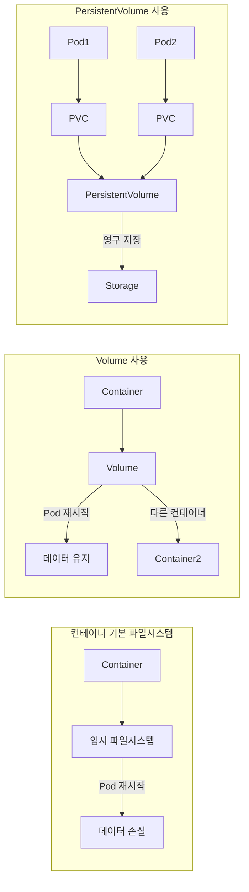
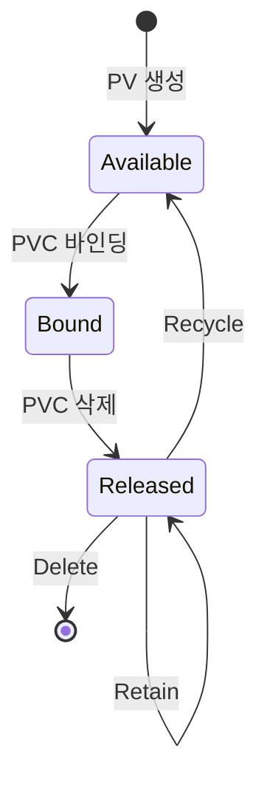
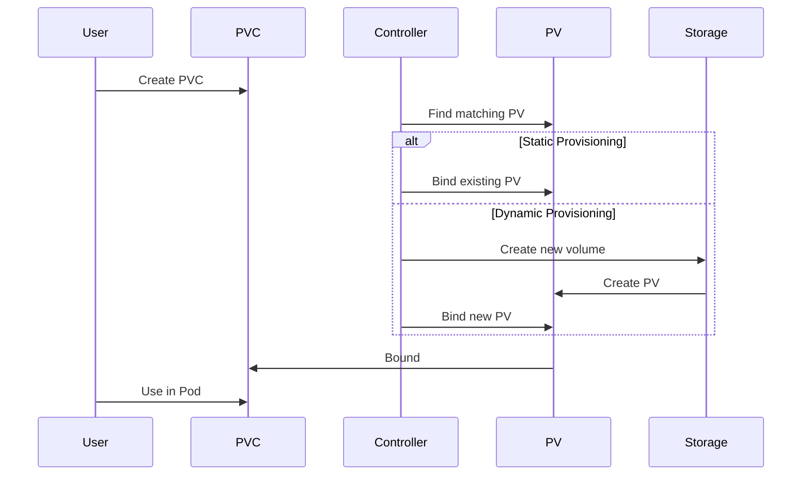
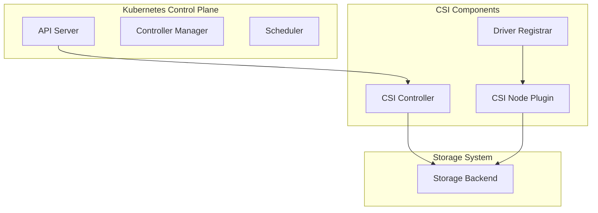
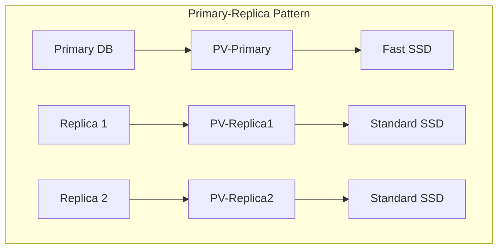

## 개요  
  
Kubernetes에서 **Storage**는 컨테이너의 임시 파일 시스템을 넘어서 데이터를 영구적으로 저장하고 Pod 간에 공유할 수 있게 하는 핵심 리소스입니다. Volume, PersistentVolume(  
PV), PersistentVolumeClaim(PVC), StorageClass를 통해 다양한 스토리지 요구사항을 충족할 수 있습니다.  
  
### 핵심 개념  
  
- **Volume**: Pod 수명 주기와 연결된 저장 공간  
- **PersistentVolume (PV)**: 클러스터 수준의 스토리지 리소스  
- **PersistentVolumeClaim (PVC)**: 사용자의 스토리지 요청  
- **StorageClass**: 동적 스토리지 프로비저닝을 위한 템플릿  
- **CSI (Container Storage Interface)**: 스토리지 벤더 통합 표준  
  
---  
  
## Storage가 필요한 이유  
  
### 컨테이너 파일시스템의 한계  
  

  
**문제점 해결**:  
  
- Pod 재시작 시 데이터 손실 방지  
- 컨테이너 간 데이터 공유  
- 스테이트풀 애플리케이션 지원  
- 데이터베이스, 파일 저장소 등 영구 저장 필요  
  
---  
  
## Volume 이해하기  
  
### Volume 개념  
  
**Volume**은 Pod 명세에 정의되며 Pod의 수명 주기와 함께하는 저장 공간입니다. 컨테이너가 재시작되어도 데이터가 유지되며, Pod 내 여러 컨테이너 간에 데이터를 공유할 수 있습니다.  
  
### 주요 Volume 타입  
  
#### 1. emptyDir  
  
**개념**: Pod가 생성될 때 빈 디렉토리를 생성하며, Pod가 삭제되면 함께 삭제되는 임시 볼륨입니다.  
  
**특징**:  
  
- **생명주기**: Pod와 동일  
- **저장 위치**: 노드의 디스크 또는 메모리  
- **데이터 공유**: 같은 Pod 내 컨테이너 간 공유 가능  
- **용량 제한**: 노드 리소스에 의존  
  
**사용 시나리오**:  
  
- **임시 캐시**: 계산 결과 캐싱  
- **체크포인트**: 장시간 계산의 중간 결과 저장  
- **컨테이너 간 데이터 교환**: 사이드카 패턴에서 로그 수집  
- **스크래치 공간**: 임시 작업 공간  
  
**메모리 백엔드 옵션**:  
  
```yaml  
volumes:  
  - name: cache-volume  
    emptyDir:  
      medium: Memory  # RAM에 저장 (tmpfs)  
      sizeLimit: 1Gi  # 크기 제한  
```  
  
#### 2. hostPath  
  
**개념**: 노드(호스트)의 파일시스템 경로를 Pod에 마운트하는 볼륨입니다.  
  
**보안 위험**:  
  
- **노드 접근**: 호스트 파일시스템에 직접 접근  
- **권한 상승**: 컨테이너가 호스트 권한 획득 가능  
- **데이터 노출**: 민감한 시스템 파일 접근 가능  
  
**타입 옵션**:  
  
| 타입                    | 설명          | 용도       |  
|-----------------------|-------------|----------|  
| **DirectoryOrCreate** | 디렉토리 없으면 생성 | 일반적 사용   |  
| **Directory**         | 기존 디렉토리만    | 검증된 경로   |  
| **FileOrCreate**      | 파일 없으면 생성   | 설정 파일    |  
| **File**              | 기존 파일만      | 특정 파일 접근 |  
| **Socket**            | UNIX 소켓     | IPC 통신   |  
| **CharDevice**        | 문자 디바이스     | 하드웨어 접근  |  
| **BlockDevice**       | 블록 디바이스     | 디스크 접근   |  
  
**사용 시나리오**:  
  
- **시스템 모니터링**: /proc, /sys 접근  
- **Docker 소켓**: 컨테이너 관리  
- **노드 로컬 캐시**: 노드별 데이터 저장  
- **개발/테스트**: 로컬 개발 환경  
  
#### 3. configMap  
  
**개념**: ConfigMap 데이터를 파일로 마운트하는 볼륨입니다.  
  
**특징**:  
  
- **동적 업데이트**: ConfigMap 변경 시 자동 반영 (약 1분 지연)  
- **읽기 전용**: 기본적으로 읽기 전용 마운트  
- **선택적 마운트**: 특정 키만 파일로 마운트 가능  
  
**사용 시나리오**:  
  
- **애플리케이션 설정**: 설정 파일 제공  
- **스크립트**: 초기화 스크립트  
- **정적 콘텐츠**: HTML, CSS 등  
  
#### 4. secret  
  
**개념**: Secret 데이터를 파일로 마운트하는 볼륨입니다.  
  
**보안 특징**:  
  
- **메모리 저장**: tmpfs에 저장되어 디스크 쓰기 방지  
- **권한 설정**: 파일 권한 0400 등 설정 가능  
- **Base64 디코딩**: 자동으로 디코딩되어 마운트  
  
**사용 시나리오**:  
  
- **인증서**: TLS 인증서 및 키  
- **인증 정보**: 데이터베이스 패스워드  
- **API 키**: 외부 서비스 인증  
- **SSH 키**: 원격 접속용 키  
  
#### 5. nfs  
  
**개념**: 네트워크 파일 시스템(NFS) 서버를 마운트하는 볼륨입니다.  
  
**특징**:  
  
- **동시 접근**: 여러 Pod에서 동시 읽기/쓰기  
- **영구 저장**: Pod 삭제 후에도 데이터 유지  
- **네트워크 의존**: 네트워크 성능에 영향받음  
  
**사용 시나리오**:  
  
- **공유 데이터**: 여러 Pod 간 데이터 공유  
- **레거시 통합**: 기존 NFS 인프라 활용  
- **백업 스토리지**: 중앙 집중식 백업  
  
#### 6. persistentVolumeClaim  
  
**개념**: PersistentVolumeClaim을 통해 PersistentVolume을 사용하는 볼륨입니다.  
  
**특징**:  
  
- **추상화**: 스토리지 구현과 사용 분리  
- **동적 프로비저닝**: StorageClass 통한 자동 생성  
- **생명주기 관리**: Pod와 독립적인 데이터 생명주기  
  
---  
  
## PersistentVolume (PV) 이해하기  
  
### PV 개념  
  
**PersistentVolume**은 클러스터 레벨의 스토리지 리소스로, 관리자가 프로비저닝하거나 StorageClass를 통해 동적으로 생성됩니다. PV는 특정 스토리지 시스템의 구현 세부사항을 캡슐화합니다.  
  
### PV 속성  
  
#### 1. Capacity (용량)  
  
**스토리지 크기**:  
  
- **단위**: Ki, Mi, Gi, Ti, Pi, Ei (2의 거듭제곱)  
- **예시**: `10Gi`, `100Mi`, `1Ti`  
- **주의**: 실제 프로비저닝된 크기와 다를 수 있음  
  
#### 2. Access Modes (접근 모드)  
  
| 모드                   | 약어   | 설명              | 사용 사례            |  
|----------------------|------|-----------------|------------------|  
| **ReadWriteOnce**    | RWO  | 단일 노드에서 읽기/쓰기   | 데이터베이스, 로컬 스토리지  |  
| **ReadOnlyMany**     | ROX  | 여러 노드에서 읽기 전용   | 정적 콘텐츠, 설정 파일    |  
| **ReadWriteMany**    | RWX  | 여러 노드에서 읽기/쓰기   | 공유 파일 시스템, NFS   |  
| **ReadWriteOncePod** | RWOP | 단일 Pod에서만 읽기/쓰기 | 싱글톤 워크로드 (1.27+) |  
  
#### 3. Reclaim Policy (회수 정책)  
  
**Retain (보존)**:  
  
- PVC 삭제 시 PV와 데이터 유지  
- 수동으로 정리 필요  
- 중요 데이터에 사용  
  
**Delete (삭제)**:  
  
- PVC 삭제 시 PV와 스토리지 자동 삭제  
- 클라우드 환경 기본값  
- 임시 데이터에 적합  
  
**Recycle (재활용)** - Deprecated:  
  
- 기본 스크러빙 (rm -rf /thevolume/*)  
- 새로운 claim에 재사용  
- 현재는 사용 권장하지 않음  
  
#### 4. Storage Class  
  
**역할**:  
  
- 동적 프로비저닝 템플릿  
- 스토리지 타입과 파라미터 정의  
- QoS 레벨 구분 (fast, standard, slow)  
  
#### 5. Mount Options  
  
**파일시스템 마운트 옵션**:  
  
- **일반**: `rw`, `ro`, `noexec`, `nosuid`  
- **NFS**: `hard`, `soft`, `timeo=600`  
- **성능**: `noatime`, `nodiratime`  
  
### PV 생명주기  
  

  
**상태 설명**:  
  
- **Available**: 사용 가능한 상태  
- **Bound**: PVC와 연결된 상태  
- **Released**: PVC 삭제 후 대기 상태  
- **Failed**: 회수 실패 상태  
  
---  
  
## PersistentVolumeClaim (PVC) 이해하기  
  
### PVC 개념  
  
**PersistentVolumeClaim**은 사용자가 스토리지를 요청하는 방법입니다. CPU나 메모리를 요청하듯이 특정 크기와 접근 모드의 스토리지를 요청합니다.  
  
### PVC 속성  
  
#### 1. Resources (리소스 요청)  
  
**스토리지 요청**:  
  
```yaml  
resources:  
  requests:  
    storage: 10Gi  # 최소 요구 용량  
  limits:  
    storage: 20Gi  # 최대 허용 용량 (일부 프로비저너만 지원)  
```  
  
#### 2. Access Modes  
  
PV와 동일한 접근 모드 지정:  
  
- 요청한 모드를 지원하는 PV와만 바인딩  
- 여러 모드 동시 요청 가능  
  
#### 3. Selector  
  
**Label Selector**:  
  
- 특정 라벨을 가진 PV 선택  
- matchLabels 또는 matchExpressions 사용  
  
#### 4. Storage Class  
  
**동적 프로비저닝**:  
  
- StorageClass 이름 지정  
- 빈 문자열("")은 기본 StorageClass 비활성화  
- 미지정 시 기본 StorageClass 사용  
  
### PVC와 PV 바인딩  
  
**바인딩 프로세스**:  
  

  
**매칭 기준**:  
  
1. **용량**: PVC 요청 ≤ PV 용량  
2. **접근 모드**: PVC 모드 ⊆ PV 모드  
3. **StorageClass**: 동일한 StorageClass  
4. **Selector**: Label 매칭 (옵션)  
  
---  
  
## StorageClass 이해하기  
  
### StorageClass 개념  
  
**StorageClass**는 동적 볼륨 프로비저닝을 위한 템플릿으로, 다양한 스토리지 백엔드와 그들의 파라미터를 정의합니다.  
  
### 주요 구성 요소  
  
#### 1. Provisioner  
  
**내장 프로비저너**:  
  
| 프로비저너                        | 설명                  | 환경        |  
|------------------------------|---------------------|-----------|  
| kubernetes.io/aws-ebs        | AWS EBS             | AWS       |  
| kubernetes.io/gce-pd         | GCE Persistent Disk | GCP       |  
| kubernetes.io/azure-disk     | Azure Disk          | Azure     |  
| kubernetes.io/cinder         | OpenStack Cinder    | OpenStack |  
| kubernetes.io/vsphere-volume | vSphere             | VMware    |  
| kubernetes.io/no-provisioner | 수동 프로비저닝            | Any       |  
  
**CSI 프로비저너**:  
  
- **형식**: `<vendor>.csi.k8s.io`  
- **예시**: `ebs.csi.aws.com`, `pd.csi.storage.gke.io`  
  
#### 2. Parameters  
  
**프로비저너별 파라미터**:  
  
**AWS EBS**:  
  
```yaml  
parameters:  
  type: gp3        # gp2, gp3, io1, io2, sc1, st1  
  iopsPerGB: "10"  # io1, io2용  
  encrypted: "true"  
  kmsKeyId: "arn:aws:kms:..."  
```  
  
**GCP PD**:  
  
```yaml  
parameters:  
  type: pd-ssd     # pd-standard, pd-ssd, pd-balanced  
  replication-type: regional-pd  # none, regional-pd  
  zones: us-central1-a,us-central1-b  
```  
  
**Azure Disk**:  
  
```yaml  
parameters:  
  skuName: Premium_LRS  # Standard_LRS, Premium_LRS, StandardSSD_LRS, UltraSSD_LRS  
  location: eastus  
  cachingmode: ReadWrite  # None, ReadOnly, ReadWrite  
```  
  
#### 3. Reclaim Policy  
  
**정책 옵션**:  
  
- **Delete**: 기본값, PVC 삭제 시 볼륨도 삭제  
- **Retain**: 볼륨 유지, 수동 관리 필요  
  
#### 4. Volume Binding Mode  
  
**Immediate (즉시 바인딩)**:  
  
- PVC 생성 즉시 PV 프로비저닝  
- 노드 배치 전 볼륨 생성  
  
**WaitForFirstConsumer (지연 바인딩)**:  
  
- Pod 스케줄링 후 PV 생성  
- 토폴로지 제약 조건 준수  
- 권장 설정  
  
#### 5. Allowed Topologies  
  
**토폴로지 제한**:  
  
```yaml  
allowedTopologies:  
  - matchLabelExpressions:  
      - key: topology.kubernetes.io/zone  
        values:  
          - us-east-1a  
          - us-east-1b  
```  
  
### 기본 StorageClass  
  
**설정 방법**:  
  
```yaml  
metadata:  
  annotations:  
    storageclass.kubernetes.io/is-default-class: "true"  
```  
  
**동작**:  
  
- PVC에서 StorageClass 미지정 시 사용  
- 클러스터당 하나만 설정 권장  
  
---  
  
## CSI (Container Storage Interface)  
  
### CSI 개념  
  
**Container Storage Interface**는 Kubernetes와 스토리지 시스템 간의 표준 인터페이스로, 스토리지 벤더가 플러그인을 개발할 수 있게 합니다.  
  
### CSI 아키텍처  
  

  
### CSI 드라이버 구성 요소  
  
#### 1. Controller Plugin  
  
**역할**:  
  
- 볼륨 생성/삭제  
- 볼륨 연결/분리  
- 스냅샷 관리  
- 볼륨 확장  
  
**배포 방식**: StatefulSet 또는 Deployment  
  
#### 2. Node Plugin  
  
**역할**:  
  
- 볼륨 마운트/언마운트  
- 파일시스템 포맷  
- 볼륨 통계 수집  
  
**배포 방식**: DaemonSet  
  
### CSI 기능  
  
#### 1. Volume Snapshots  
  
**스냅샷 리소스**:  
  
- **VolumeSnapshot**: 스냅샷 요청  
- **VolumeSnapshotContent**: 실제 스냅샷  
- **VolumeSnapshotClass**: 스냅샷 템플릿  
  
**사용 사례**:  
  
- 백업/복원  
- 데이터 복제  
- 개발/테스트 환경 복사  
  
#### 2. Volume Expansion  
  
**온라인 확장**:  
  
- Pod 실행 중 볼륨 크기 증가  
- 파일시스템 자동 확장  
- allowVolumeExpansion: true 필요  
  
#### 3. Volume Cloning  
  
**데이터 소스 복제**:  
  
- 기존 PVC에서 새 PVC 생성  
- 스냅샷 없이 직접 복제  
- 빠른 환경 복제  
  
---  
  
## 스토리지 패턴과 베스트 프랙티스  
  
### 1. StatefulSet과 영구 스토리지  
  
**VolumeClaimTemplate 사용**:  
  
```yaml  
volumeClaimTemplates:  
  - metadata:  
      name: data  
    spec:  
      accessModes: [ "ReadWriteOnce" ]  
      storageClassName: fast-ssd  
      resources:  
        requests:  
          storage: 10Gi  
```  
  
**특징**:  
  
- Pod별 전용 PVC 자동 생성  
- 순서대로 볼륨 프로비저닝  
- Pod 재생성 시 동일 PVC 재사용  
  
### 2. 데이터베이스 스토리지 패턴  
  
**고가용성 구성**:  
  

  
**권장사항**:  
  
- **Primary**: 고성능 스토리지 (SSD, High IOPS)  
- **Replica**: 표준 스토리지로 비용 최적화  
- **백업**: 별도 스냅샷 또는 오브젝트 스토리지  
  
### 3. 공유 파일 시스템 패턴  
  
**ReadWriteMany 시나리오**:  
  
```yaml  
# NFS 또는 CephFS 사용  
spec:  
  accessModes:  
    - ReadWriteMany  
  capacity:  
    storage: 100Gi  
  nfs:  
    server: nfs-server.example.com  
    path: /shared/data  
```  
  
**사용 사례**:  
  
- 정적 콘텐츠 서빙  
- 로그 수집 및 분석  
- 머신러닝 데이터셋  
- 공유 캐시  
  
### 4. 임시 스토리지 관리  
  
**Resource Limits 설정**:  
  
```yaml  
resources:  
  limits:  
    ephemeral-storage: 2Gi  
  requests:  
    ephemeral-storage: 1Gi  
```  
  
**모니터링 포인트**:  
  
- 컨테이너 임시 파일  
- emptyDir 볼륨  
- 로그 파일 증가  
  
### 5. 스토리지 성능 최적화  
  
#### IOPS 튜닝  
  
**클라우드별 설정**:  
  
- **AWS**: io2 볼륨으로 IOPS 보장  
- **GCP**: pd-ssd 또는 pd-extreme  
- **Azure**: Ultra Disk 또는 Premium SSD v2  
  
#### 캐싱 전략  
  
**계층적 캐싱**:  
  
1. **메모리 캐시**: emptyDir (medium: Memory)  
2. **로컬 SSD**: hostPath 또는 local PV  
3. **네트워크 스토리지**: PVC  
  
### 6. 백업 및 복구 전략  
  
#### 스냅샷 기반 백업  
  
```yaml  
apiVersion: snapshot.storage.k8s.io/v1  
kind: VolumeSnapshot  
metadata:  
  name: data-snapshot  
spec:  
  volumeSnapshotClassName: csi-snapclass  
  source:  
    persistentVolumeClaimName: data-pvc  
```  
  
#### Velero를 통한 백업  
  
**장점**:  
  
- 클러스터 레벨 백업  
- 크로스 클라우드 마이그레이션  
- 스케줄 백업 지원  
  
---  
  
## 보안 고려사항  
  
### 1. 암호화  
  
#### At-Rest 암호화  
  
**클라우드 프로바이더**:  
  
- 자동 암호화 지원  
- KMS 통합  
- 고객 관리 키 (CMK) 옵션  
  
**온프레미스**:  
  
- LUKS (Linux Unified Key Setup)  
- 스토리지 어플라이언스 암호화  
  
#### In-Transit 암호화  
  
**프로토콜**:  
  
- iSCSI over TLS  
- NFS with Kerberos  
- Ceph with encryption  
  
### 2. 접근 제어  
  
#### RBAC 설정  
  
```yaml  
apiVersion: rbac.authorization.k8s.io/v1  
kind: Role  
metadata:  
  name: pvc-user  
rules:  
  - apiGroups: [ "" ]  
    resources: [ "persistentvolumeclaims" ]  
    verbs: [ "get", "list", "create", "delete" ]  
```  
  
#### Pod Security Context  
  
```yaml  
securityContext:  
  runAsUser: 1000  
  runAsGroup: 3000  
  fsGroup: 2000  # 볼륨 파일 그룹  
  fsGroupChangePolicy: "OnRootMismatch"  
```  
  
### 3. 감사 (Auditing)  
  
**추적 항목**:  
  
- PV/PVC 생성/삭제  
- 볼륨 마운트/언마운트  
- 스냅샷 작업  
- 접근 권한 변경  
  
---  
  
## 트러블슈팅  
  
### 1. PVC Pending 상태  
  
**원인과 해결**:  
  
| 원인               | 진단                          | 해결                       |  
|------------------|-----------------------------|--------------------------|  
| PV 없음            | `kubectl get pv`            | PV 생성 또는 StorageClass 확인 |  
| 용량 불일치           | PVC requests vs PV capacity | 적절한 크기의 PV 생성            |  
| AccessMode 불일치   | PVC와 PV의 accessModes 비교     | 호환되는 모드 설정               |  
| StorageClass 불일치 | PVC와 PV의 storageClassName   | 동일한 StorageClass 사용      |  
| 노드 친화성           | WaitForFirstConsumer        | Pod 스케줄링 확인              |  
  
### 2. Pod의 Volume Mount 실패  
  
**진단 체크리스트**:  
  
1. **PVC 상태 확인**:  
  
```bash  
kubectl get pvc <pvc-name> -o yaml  
```  
  
2. **Pod 이벤트 확인**:  
  
```bash  
kubectl describe pod <pod-name>  
```  
  
3. **노드 로그 확인**:  
  
```bash  
kubectl logs -n kube-system <csi-node-pod>  
```  
  
**일반적인 오류**:  
  
- **Permission denied**: fsGroup 설정 확인  
- **Read-only file system**: PV의 accessMode 확인  
- **Volume not found**: 프로비저너 상태 확인  
- **Mount timeout**: 네트워크 연결 확인  
  
### 3. 성능 문제  
  
**진단 도구**:  
  
```bash  
# IOPS 측정  
fio --name=randread --ioengine=libaio --iodepth=16 --rw=randread --bs=4k --size=1G  
  
# 대역폭 측정  dd if=/dev/zero of=/mount/testfile bs=1M count=1024 oflag=direct  
  
# 지연시간 측정  
ioping -c 10 /mount/  
```  
  
**최적화 방법**:  
  
- 적절한 StorageClass 선택  
- ReadAhead 설정 조정  
- 파일시스템 선택 (ext4, xfs)  
- 마운트 옵션 최적화  
  
### 4. 용량 관리  
  
**모니터링**:  
  
```bash  
# PVC 사용량 확인  
kubectl exec -it <pod-name> -- df -h  
  
# PV 용량 확인  
kubectl get pv -o custom-columns=NAME:.metadata.name,CAPACITY:.spec.capacity.storage  
```  
  
**자동 확장**:  
  
- Volume Expansion 활성화  
- 모니터링 알림 설정  
- 자동 정리 스크립트  
  
---  
  
## 실무 베스트 프랙티스  
  
### 1. 스토리지 계획  
  
**용량 계획**:  
  
- 현재 사용량 + 성장률 고려  
- 20-30% 여유 공간 확보  
- 스냅샷 공간 별도 계산  
  
**성능 요구사항**:  
  
- IOPS 요구사항 명확히 정의  
- 대역폭 요구사항 계산  
- 지연시간 SLA 설정  
  
### 2. 비용 최적화  
  
**계층화 전략**:  
  
- Hot 데이터: 고성능 SSD  
- Warm 데이터: 표준 SSD  
- Cold 데이터: HDD 또는 오브젝트 스토리지  
  
**라이프사이클 관리**:  
  
- 자동 스냅샷 정책  
- 오래된 데이터 아카이빙  
- 미사용 볼륨 정리  
  
### 3. 고가용성  
  
**다중 복제**:  
  
- 애플리케이션 레벨 복제  
- 스토리지 레벨 복제  
- 크로스 리전 백업  
  
**장애 복구**:  
  
- RTO/RPO 목표 설정  
- 자동 페일오버 구성  
- 정기적 복구 테스트  
  
### 4. 모니터링과 알림  
  
**핵심 메트릭**:  
  
- 용량 사용률  
- IOPS 사용률  
- 지연시간  
- 에러율  
  
**알림 설정**:  
  
- 용량 80% 도달  
- 성능 저하 감지  
- 마운트 실패  
- 스냅샷 실패  
  
---  
  
## 참고 문서  
  
### Kubernetes 공식 문서  
  
- [Volumes](https://kubernetes.io/docs/concepts/storage/volumes/)  
- [Persistent Volumes](https://kubernetes.io/docs/concepts/storage/persistent-volumes/)  
- [Storage Classes](https://kubernetes.io/docs/concepts/storage/storage-classes/)  
- [Dynamic Volume Provisioning](https://kubernetes.io/docs/concepts/storage/dynamic-provisioning/)  
- [Volume Snapshots](https://kubernetes.io/docs/concepts/storage/volume-snapshots/)  
- [CSI](https://kubernetes.io/docs/concepts/storage/volumes/#csi)  
  
### CSI 관련 문서  
  
- [CSI Specification](https://github.com/container-storage-interface/spec)  
- [CSI Drivers List](https://kubernetes-csi.github.io/docs/drivers.html)  
  
### 클라우드 프로바이더 문서  
  
- [AWS EBS CSI Driver](https://github.com/kubernetes-sigs/aws-ebs-csi-driver)  
- [GCP PD CSI Driver](https://github.com/kubernetes-sigs/gcp-compute-persistent-disk-csi-driver)  
- [Azure Disk CSI Driver](https://github.com/kubernetes-sigs/azuredisk-csi-driver)  
  
---  
보겠습니다.