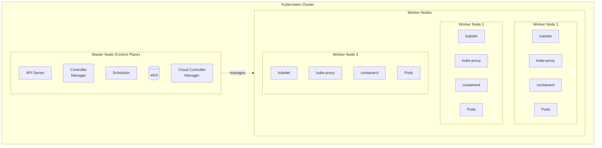

## 목차
1. [Kubernetes 개요](#kubernetes-개요)
2. [클러스터 구조](#클러스터-구조)
3. [핵심 구성 요소](#핵심-구성-요소)
4. [Kubernetes 오브젝트](#kubernetes-오브젝트)

---

## Kubernetes 개요

### Kubernetes란?
Kubernetes(K8s)는 컨테이너화된 애플리케이션의 배포, 확장, 관리를 자동화하는 오픈소스 컨테이너 오케스트레이션 플랫폼입니다.

### 왜 Kubernetes가 필요한가?

#### 컨테이너 오케스트레이션의 필요성
- **복잡성 관리**: 수백, 수천 개의 컨테이너 관리
- **고가용성**: 자동 복구 및 재시작
- **확장성**: 수요에 따른 자동 스케일링
- **배포 자동화**: 무중단 배포 및 롤백
- **리소스 최적화**: 효율적인 리소스 활용

### 주요 기능

#### 1. 자동 배포 및 복구
- 선언적 구성과 자동화
- 원하는 상태(Desired State) 관리
- 자가 치유(Self-healing) 기능

#### 2. 서비스 디스커버리와 로드 밸런싱
- DNS 이름 또는 IP로 서비스 노출
- 자동 로드 밸런싱
- 서비스 메시 통합

#### 3. 자동 스케일링
- Horizontal Pod Autoscaler (HPA)
- Vertical Pod Autoscaler (VPA)
- Cluster Autoscaler

#### 4. 자동 롤아웃과 롤백
- 무중단 배포
- 카나리 배포
- 블루-그린 배포
- 자동 롤백

#### 5. 시크릿과 구성 관리
- 민감한 정보 안전하게 관리
- ConfigMap으로 구성 분리
- 환경별 구성 관리

#### 6. 스토리지 오케스트레이션
- 다양한 스토리지 시스템 지원
- 동적 볼륨 프로비저닝
- 스토리지 클래스 관리

---

## 클러스터 구조

### 전체 아키텍처



### Master Node (Control Plane)

Control Plane은 클러스터의 두뇌 역할을 하며, 전체 클러스터를 관리하고 조정합니다.

#### 구성 요소

##### 1. API Server (kube-apiserver)
- **역할**: Kubernetes API를 노출하는 컨트롤 플레인의 프론트엔드
- **기능**:
  - 모든 REST 요청 처리
  - 인증(Authentication) 및 인가(Authorization)
  - 요청 검증 및 처리
  - etcd와의 유일한 통신 채널
- **특징**:
  - 수평 확장 가능
  - 로드 밸런서 뒤에 여러 인스턴스 배치 가능

##### 2. etcd
- **역할**: 분산 키-값 저장소
- **기능**:
  - 모든 클러스터 데이터 저장
  - 클러스터 상태 정보 유지
  - 구성 데이터 저장
- **특징**:
  - 고가용성과 일관성 보장
  - Raft 합의 알고리즘 사용
  - 데이터 암호화 지원

##### 3. Scheduler (kube-scheduler)
- **역할**: 새로 생성된 Pod를 적절한 노드에 할당
- **결정 요소**:
  - 리소스 요구사항 (CPU, Memory)
  - 하드웨어/소프트웨어 제약 조건
  - 어피니티/안티-어피니티 규칙
  - 데이터 지역성
  - 워크로드 간섭
  - Taints와 Tolerations

##### 4. Controller Manager (kube-controller-manager)
- **역할**: 여러 컨트롤러 프로세스 실행
- **주요 컨트롤러**:
  - **Node Controller**: 노드 상태 모니터링
  - **Replication Controller**: Pod 수 유지
  - **Endpoints Controller**: 서비스와 Pod 연결
  - **Service Account Controller**: 네임스페이스별 계정 생성
  - **Job Controller**: Job 실행 관리
  - **CronJob Controller**: 스케줄된 작업 관리

##### 5. Cloud Controller Manager (선택적)
- **역할**: 클라우드 제공자별 컨트롤러 실행
- **기능**:
  - 노드 관리 (클라우드 인스턴스)
  - 로드 밸런서 관리
  - 라우팅 관리
  - 볼륨 관리

### Worker Node

Worker Node는 실제 컨테이너가 실행되는 곳입니다.

#### 구성 요소

##### 1. kubelet
- **역할**: 각 노드에서 실행되는 에이전트
- **기능**:
  - Pod 사양에 따라 컨테이너 실행
  - 컨테이너 상태 모니터링 및 보고
  - 컨테이너 라이프사이클 관리
  - 리소스 관리
  - 헬스체크 수행
- **통신**:
  - API Server와 통신
  - Container Runtime과 통신

##### 2. kube-proxy
- **역할**: 네트워크 프록시와 로드 밸런서
- **기능**:
  - Service 추상화 구현
  - 네트워크 규칙 관리
  - 로드 밸런싱
- **모드**:
  - **iptables mode**: 기본 모드
  - **IPVS mode**: 대규모 클러스터용
  - **userspace mode**: 레거시

##### 3. Container Runtime
- **역할**: 컨테이너 실행 담당
- **지원 런타임**:
  - Docker (deprecated in 1.24+)
  - containerd
  - CRI-O
  - Kata Containers
- **CRI (Container Runtime Interface)**:
  - Kubernetes와 컨테이너 런타임 간 표준 인터페이스

### 클러스터 통신 흐름

```
사용자/CI/CD → kubectl → API Server
                           ↓
                    Authentication/Authorization
                           ↓
                         etcd (상태 저장)
                           ↓
                    Controllers/Scheduler
                           ↓
                        kubelet
                           ↓
                    Container Runtime
                           ↓
                        Container
```

---

## 핵심 구성 요소

### Pod

#### 개념
- Kubernetes의 최소 배포 단위
- 하나 이상의 컨테이너 그룹
- 같은 네트워크와 스토리지 공유
- 일시적(Ephemeral) 특성

#### Pod 구조
```
┌─────────────────────────────────┐
│             Pod                 │
│  ┌───────────────────────────┐  │
│  │     Pause Container       │  │ ← 네트워크 네임스페이스 유지
│  └───────────────────────────┘  │
│  ┌───────────────────────────┐  │
│  │    Application Container  │  │
│  └───────────────────────────┘  │
│  ┌───────────────────────────┐  │
│  │    Sidecar Container      │  │ ← 선택적
│  └───────────────────────────┘  │
│                                 │
│  Shared: Network, Storage, IPC  │
└─────────────────────────────────┘
```

#### Pod 정의 예제
```yaml
apiVersion: v1
kind: Pod
metadata:
  name: multi-container-pod
  labels:
    app: myapp
    tier: frontend
spec:
  containers:
  # 메인 애플리케이션 컨테이너
  - name: web
    image: nginx:1.21
    ports:
    - containerPort: 80
    volumeMounts:
    - name: shared-data
      mountPath: /usr/share/nginx/html
    resources:
      requests:
        memory: "64Mi"
        cpu: "250m"
      limits:
        memory: "128Mi"
        cpu: "500m"

  # 사이드카 컨테이너 (로그 수집)
  - name: sidecar
    image: busybox
    command: ['sh', '-c', 'while true; do echo "Logging..."; sleep 30; done']
    volumeMounts:
    - name: shared-data
      mountPath: /data

  volumes:
  - name: shared-data
    emptyDir: {}

  restartPolicy: Always
  nodeSelector:
    disktype: ssd
```

### Service

#### 개념
- Pod 집합에 대한 안정적인 네트워크 엔드포인트
- Pod의 생명주기와 독립적
- 로드 밸런싱 제공
- 서비스 디스커버리 지원

#### Service 타입

##### 1. ClusterIP (기본값)
```yaml
apiVersion: v1
kind: Service
metadata:
  name: my-service
spec:
  type: ClusterIP
  selector:
    app: myapp
  ports:
  - protocol: TCP
    port: 80
    targetPort: 8080
```
- 클러스터 내부 IP 노출
- 클러스터 내부에서만 접근 가능

##### 2. NodePort
```yaml
apiVersion: v1
kind: Service
metadata:
  name: nodeport-service
spec:
  type: NodePort
  selector:
    app: myapp
  ports:
  - protocol: TCP
    port: 80
    targetPort: 8080
    nodePort: 30080  # 30000-32767 범위
```
- 각 노드의 정적 포트 노출
- `<NodeIP>:<NodePort>`로 접근

##### 3. LoadBalancer
```yaml
apiVersion: v1
kind: Service
metadata:
  name: loadbalancer-service
spec:
  type: LoadBalancer
  selector:
    app: myapp
  ports:
  - protocol: TCP
    port: 80
    targetPort: 8080
```
- 외부 로드 밸런서 사용
- 클라우드 제공자 필요

##### 4. ExternalName
```yaml
apiVersion: v1
kind: Service
metadata:
  name: external-service
spec:
  type: ExternalName
  externalName: external.example.com
```
- 외부 DNS 이름에 매핑
- 클러스터 외부 서비스 연결

#### Service Discovery

##### DNS 기반
```yaml
# 서비스 DNS 형식
<service-name>.<namespace>.svc.cluster.local

# 예시
mysql.default.svc.cluster.local
redis.production.svc.cluster.local
```

##### 환경 변수 기반
```bash
# 자동 생성되는 환경 변수
MYSERVICE_SERVICE_HOST=10.0.0.11
MYSERVICE_SERVICE_PORT=80
```

### Deployment

#### 개념
- Pod의 선언적 업데이트
- ReplicaSet 관리
- 롤링 업데이트와 롤백
- 스케일링

#### Deployment 정의
```yaml
apiVersion: apps/v1
kind: Deployment
metadata:
  name: nginx-deployment
  labels:
    app: nginx
spec:
  replicas: 3
  strategy:
    type: RollingUpdate
    rollingUpdate:
      maxSurge: 1        # 동시에 생성할 수 있는 최대 Pod 수
      maxUnavailable: 1  # 동시에 삭제할 수 있는 최대 Pod 수
  selector:
    matchLabels:
      app: nginx
  template:
    metadata:
      labels:
        app: nginx
    spec:
      containers:
      - name: nginx
        image: nginx:1.21
        ports:
        - containerPort: 80
        livenessProbe:
          httpGet:
            path: /
            port: 80
          initialDelaySeconds: 30
          periodSeconds: 10
        readinessProbe:
          httpGet:
            path: /
            port: 80
          initialDelaySeconds: 5
          periodSeconds: 5
        resources:
          requests:
            memory: "128Mi"
            cpu: "500m"
          limits:
            memory: "256Mi"
            cpu: "1000m"
```

#### 배포 전략

##### Rolling Update (기본값)
- 점진적으로 Pod 교체
- 무중단 배포
- 설정 가능한 속도

##### Recreate
- 모든 Pod 삭제 후 새로 생성
- 다운타임 발생
- 동시에 두 버전 실행 불가할 때 사용

#### 롤백
```bash
# 배포 히스토리 확인
kubectl rollout history deployment/nginx-deployment

# 이전 버전으로 롤백
kubectl rollout undo deployment/nginx-deployment

# 특정 리비전으로 롤백
kubectl rollout undo deployment/nginx-deployment --to-revision=2
```

### Namespace

#### 개념
- 클러스터 리소스를 여러 사용자 간 분리
- 리소스 이름의 범위 제공
- 리소스 할당량 설정 가능
- 액세스 제어 경계

#### 기본 Namespace
- **default**: 기본 네임스페이스
- **kube-system**: Kubernetes 시스템 컴포넌트
- **kube-public**: 모든 사용자가 읽을 수 있는 리소스
- **kube-node-lease**: 노드 하트비트 관련

#### Namespace 정의
```yaml
apiVersion: v1
kind: Namespace
metadata:
  name: development
  labels:
    name: development
```

#### ResourceQuota
```yaml
apiVersion: v1
kind: ResourceQuota
metadata:
  name: compute-quota
  namespace: development
spec:
  hard:
    requests.cpu: "4"
    requests.memory: 8Gi
    limits.cpu: "8"
    limits.memory: 16Gi
    persistentvolumeclaims: "5"
    pods: "10"
```

#### LimitRange
```yaml
apiVersion: v1
kind: LimitRange
metadata:
  name: limit-range
  namespace: development
spec:
  limits:
  - default:
      cpu: 500m
      memory: 512Mi
    defaultRequest:
      cpu: 100m
      memory: 128Mi
    type: Container
```

---

## Kubernetes 오브젝트

### 오브젝트 스펙과 상태

#### 오브젝트 스펙 (Spec)
- 원하는 상태(Desired State) 정의
- 사용자가 제공
- YAML 또는 JSON 형식

#### 오브젝트 상태 (Status)
- 현재 상태(Current State)
- Kubernetes가 관리
- 컨트롤러가 지속적으로 조정

### 레이블과 셀렉터

#### 레이블 (Labels)
```yaml
metadata:
  labels:
    app: myapp
    tier: backend
    environment: production
    version: v1.0.0
```
- 키-값 쌍
- 오브젝트 식별 및 그룹화
- 여러 레이블 가능

#### 셀렉터 (Selectors)
```yaml
# Equality-based
selector:
  matchLabels:
    app: myapp
    tier: backend

# Set-based
selector:
  matchExpressions:
  - key: app
    operator: In
    values: [myapp, yourapp]
  - key: tier
    operator: NotIn
    values: [frontend]
```

### 어노테이션 (Annotations)
```yaml
metadata:
  annotations:
    description: "This is my application"
    managed-by: "helm"
    prometheus.io/scrape: "true"
    prometheus.io/port: "9090"
```
- 비식별 메타데이터
- 도구나 라이브러리가 사용
- 빌드, 릴리스, 이미지 정보 등

### ConfigMap과 Secret

#### ConfigMap
```yaml
apiVersion: v1
kind: ConfigMap
metadata:
  name: app-config
data:
  database_url: "mysql://localhost:3306/mydb"
  api_key: "public-api-key"
  config.yaml: |
    server:
      port: 8080
      host: 0.0.0.0
```

**사용 방법:**
```yaml
# 환경 변수로 사용
env:
- name: DATABASE_URL
  valueFrom:
    configMapKeyRef:
      name: app-config
      key: database_url

# 볼륨으로 마운트
volumes:
- name: config
  configMap:
    name: app-config
```

#### Secret
```yaml
apiVersion: v1
kind: Secret
metadata:
  name: mysecret
type: Opaque
data:
  username: YWRtaW4=  # base64 encoded
  password: MWYyZDFlMmU2N2Rm  # base64 encoded
```

**Secret 타입:**
- **Opaque**: 임의의 사용자 정의 데이터
- **kubernetes.io/service-account-token**: 서비스 계정 토큰
- **kubernetes.io/dockercfg**: Docker 레지스트리 인증
- **kubernetes.io/tls**: TLS 인증서

---

## 참고 자료

- [Kubernetes 공식 문서](https://kubernetes.io/ko/docs/)
- [Kubernetes API 레퍼런스](https://kubernetes.io/docs/reference/kubernetes-api/)
- [kubectl 치트시트](https://kubernetes.io/docs/reference/kubectl/cheatsheet/)
- [Kubernetes 베스트 프랙티스](https://kubernetes.io/docs/concepts/configuration/overview/)